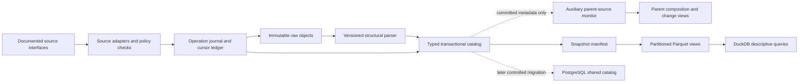

# Media lakehouse architecture and implementation plan

Version: 2, 9 October 2026. Owner: project coordinator. Status: **complete design with tested offline identity/coverage/scheduling modules; ingestion journal, snapshots and database migration not deployed**. No collector message, fresh acquisition release, server installation, new account or cloud resource is authorized by this plan.

## 1. Objective and acceptance boundary

Build a durable pool of permitted heterogeneous source material, with transparent source/native identity and reproducible analytical views. The immediate problem is collection-frame truncation, misleading count-floor completion and fragile cross-file recovery, not simply database capacity. The lakehouse must preserve noisy and incomplete evidence while making the reason a record can or cannot support a particular count explicit.

The fixed publication interval remains 1988-01-01–2026-09-21. Retrieval, source edit/version, derived correction and report times are independent. Campus publications, newspaper articles, social native bodies and future personal-voice frames remain distinct logical streams. Government is sealed and outside implementation scope. No hidden evaluator discovery, corpus-wide semantic labelling, sentiment/fear inclusion filter, destructive deduplication or target histogram is permitted.

The accepted input is 9,538 newspaper articles; 9,249 separately preserved campus articles; 42,488 social core text identities, including 42,478 currently usable dated independent bodies. Typed entity/state/context totals remain additional measures. This architecture cannot itself recover absent archives, establish author nationality or make a population-representative sample.

## 2. Architecture and authoritative responsibilities



| Component | Authority | Must not do |
|---|---|---|
| Raw store | Original received response bytes and compression/hash provenance | Treat normalized JSON/text as the original; delete duplicate-looking evidence |
| Operation journal | Request charging, saved/load states and cursor progress | Silently reset inherited counters or imply HTTP exactly-once delivery |
| Entity catalog | Stable identities, versions, observations and asserted relationships | Collapse posts, wrappers, contexts and body versions into one count |
| Source/frame registry | Declared source/unit/era/access/interface evidence | Infer author role/country from platform or source country |
| Inventory ledger | Enumerated native candidates, eligibility/disposition and acquired IDs within an exact scope | Invent complete-history denominators from page samples or source totals |
| Analytical snapshot | Exact immutable set of derivative files and transformation/config versions | Query uncontrolled file globs or present partial jobs as committed snapshots |
| Query engine | Reproducible aggregations over a declared snapshot | Mutate raw evidence or silently change analysis populations |

Initially, objects are local files and each existing SQLite store remains its stream's sole writer. Share conventions and resource accounting, not database access across streams. Catalog federation for read-only analysis uses closed manifests/derivatives. Local logical separation does not provide elastic remote storage/compute or OS-level isolation.

## 3. Logical data model

The next catalog schema should provide the following contracts, building additively on existing tables:

| Table / concept | Key and required relationships |
|---|---|
| `sources` | Stable source ID; stream; title/edition/community; independently recorded platform, publisher and acquisition-parent relationships |
| `source_assertions` | Assertion ID, subject/object, relation, status, evidence, valid time and recorded time; append-only supersession/revocation |
| `interfaces` | Interface ID, source, documented route family, adapter version, request method and separate access/use evidence |
| `frames` | Frame ID/version, source/native selection rule, target interval, recoverable era and explicit limitations |
| `raw_objects` | Logical object ID, stream, immutable storage locator, original/stored digests and sizes, media/encoding and save status |
| `requests` / `operations` | Stable operation/request attempt ID, frame/interface, charging ledger, raw reference, response status and journal transition |
| `entities` | Persistent entity ID and unique source + native namespace + native ID; source URL and native unit |
| `entity_versions` | Immutable version ID, entity, body/state/metadata hashes, native revision/edit time, parser/schema version and raw-item locator |
| `observations` | Version + request + frame; retrieval timestamp and mapping evidence |
| `publication_memberships` | Entity ↔ accepted original-publication/work key, relation basis and assertion version |
| `relations` | Typed reply/root/quote/repost/crosspost/link/copy edges; unresolved endpoints allowed |
| `attachments` | Native attachment metadata, locator, availability and collection state; binary retrieval requires its own permission/scope |
| `date_assertions` | Native reported date, normalized value/precision, admissibility, uncertainty/conflict and evidence; preserve original date |
| `inventory_scopes` | Source/frame + namespace + exact date/issue/cursor range + snapshot, exhaustion evidence and completeness state |
| `inventory_memberships` | Unique candidate identity, eligibility state/disposition, loaded entity and unresolved reason |
| `cursor_checkpoints` | Interface/frame/range, monotonic checkpoint sequence, predecessor and committed operation; opaque cursor preserved exactly |
| `snapshot_manifests` | Snapshot ID, schema/transform/config and input versions; exact files/digests/row counts; committed marker |

Native fields remain namespaced extension JSON beside the typed core. Required fields describe what was observed, not an invented value: missing native dates, author IDs, roles, places or licences can be null with a reason/state. Countable-body and usable-date predicates are named/versioned derived views, not raw admission gates. Preserve truncated, title-only, media-only, link-only, deleted/removed/tombstone, wrapper and parse-pending entities.

For future personal voice, separate source carrier, account identity, self-declared role and attributed speaker/holder. Quoted speech is not automatically the account author's emotion. Use source-native identifiers and evidence-backed role assertions; do not infer real-world identity across platforms. This is schema preparation, not authorization for private records, audio collection or automatic role classification.

## 4. Object layout and identity

Prospective local layout within the existing cumulative accounting envelope:

```text
media/<stream>/objects/<source>/<retrieval-year>/<logical-object-id>.bin.gz
media/<stream>/catalog/<stream-catalog>
media/<stream>/journal/<bounded-operation-evidence>
media/<stream>/derived/<schema-version>/<source>/<native-type>/<publication-year>/<part-id>.parquet
media/<stream>/snapshots/<snapshot-id>/manifest.json
```

Existing object locations and IDs remain valid; add locator metadata rather than moving/copying the corpus. An object ID must not be the only content identity: preserve original bytes' hash, compressed bytes' hash and native entity identity separately. Content hashes may support immutable object reuse within a compatible retention/source scope, but never merge permissions or erase source observations. No physical deduplication is implemented now.

Use bounded multi-object containers only if they retain item byte/item-index locators and independent hashes; a container is never a publication. Compression preserves bytes losslessly. Incomplete transfers have separate partial states; they do not masquerade as complete source payloads. New formats can be retained with media type and parser-pending state without forcing premature flattening.

## 5. Durable ingestion and crash reconciliation

The pipeline is Extract → durable raw save and minimal envelope → structural parse → transactional entity Load → derivative materialization. Parsing failure retains permitted raw evidence and an explicit pending/error state. It does not prevent collection from other viable sources.

Proposed operation state machine:

```text
planned -> charged -> response_saved -> catalog_committed -> cursor_committed -> snapshot_included
                  \-> failed_or_outcome_unknown (charged history retained)
```

Before HTTP, save an operation ID and charge the attempt under the existing accounting policy. A crash after dispatch with unknown return must remain charged/unknown; do not refund it solely because no local object exists. A retry is a new request attempt linked to the same intended native range. Reserve request/object/byte capacity for the actual bounded operation before starting it.

Save response bytes to a same-filesystem temporary path, flush and atomically rename to an immutable object locator; record original/stored hashes. The catalog transaction inserts/reuses entity/version/observation identities and records the committed operation plus the corresponding cursor/checkpoint transition. When the cursor cannot share the same transaction, a committed journal marker is authoritative and external state is reconstructed on replay. Do not keep JSON counter files as competing authorities once the ledger migration is validated; preserve them as historical evidence.

| Failure boundary | Required replay result |
|---|---|
| Before dispatch | Either no attempt charged or a durable planned/charged state according to the explicit attempt protocol |
| After dispatch, before complete save | Charged unknown/partial return retained; bounded retry gets a new attempt ID |
| Raw saved, catalog absent | Replay the saved object, no new HTTP required |
| During catalog transaction | Rollback or complete commit; uniqueness constraints prevent duplicate entity/version counts |
| Catalog committed, external cursor stale | Recognize operation commit; advance/check cursor without recharging or rewriting identities |
| Derivative files written, manifest uncommitted | Files are unreferenced derivatives, not an exposed snapshot |
| Manifest committed | Readers see only the exact manifest file set and validated row identities |

Atomic rename is not a distributed transaction or universal power-loss guarantee. Test these boundaries in a temporary store with deterministic fixtures, including full-disk and truncated-payload cases, before integrating the writer. Preserve the old input until restore/replay succeeds. Do not open simultaneous old/new authoritative writers.

## 6. Coverage and deduplication contracts

Use [the identity/coverage algorithm specification](MEDIA_IDENTITY_AND_COVERAGE.md). Source, work and hash-candidate views remain distinct. Confirmed source aliases are versioned mappings; shared platform or ownership does not collapse sources. All original entities remain queryable. Candidate decisions can later be confirmed, rejected or revoked without changing frozen snapshots.

Replace the two-article completion signal with explicit source-month inventory and body recovery states. Store exact observed cursor/issue/date ranges, eligibility resolution, permitted queued opportunities and actual stops. When source-month denominators are unknown, report null completion and continue useful source work. No numerical rule turns a one-source month into representative media coverage.

Compute adjacent-month source-composition decomposition and report source-entry effects separately from within-source observed changes. Preserve legitimate peaks. Define any later longitudinal comparison frame before analysis and record source membership/era changes; an expanding data pool and a longitudinal panel can coexist without dropping raw material.

## 7. Storage engines and migration decision

**Next eight-hour round:** keep the separate SQLite writers, add evidenced lookup indexes and operation/cursor journaling only after a changed-chain test. Use local Parquet snapshots with DuckDB for analysis. The observed >160-second anti-join points to an index/query issue; the measured 2.33-second median raw-to-Load interval includes locks/registry/recovery and is not isolated SQLite commit latency.

SQLite WAL can permit concurrent readers with a writer but still has one writer per file and requires same-host shared memory. It must not be enabled blindly on a network filesystem or an unverified runtime. Choose durability settings deliberately and account for journal/checkpoint growth; do not trade away durability merely to improve throughput. Verify the installed SQLite build and current supported fixes before any WAL-mode change. [SQLite WAL documentation](https://www.sqlite.org/wal.html)

**PostgreSQL target:** a shared transactional catalog is appropriate when multiple networked collectors/analysts need concurrent access, managed roles, backup/recovery or indexed relation/JSON queries. It is the preferred candidate, not an already installed dependency or measured performance winner. JSONB can index normalized native extensions, but does not retain whitespace/key order/duplicate keys; keep original raw bytes outside that representation. MySQL remains possible if an actual operational requirement favors it; no dual catalog design is needed now. [PostgreSQL JSON types](https://www.postgresql.org/docs/current/datatype-json.html)

**Analytical storage:** DuckDB can directly query Parquet and apply column/filter pushdown. Use declared snapshot files and query only needed fields; repeated SQLite-to-full-CSV exports are not the long-term analytical interface. Start without distributed table-management overhead. Consider Iceberg later when multi-engine snapshots, schema/partition evolution or shared concurrent analytical writers become real requirements. This is not a requirement for current local collection. [DuckDB Parquet](https://duckdb.org/docs/current/data/parquet/overview), [Iceberg evolution](https://iceberg.apache.org/docs/latest/evolution/)

## 8. Derivatives, partitions and schema evolution

Materialize distinct views for all retained entities, readable native bodies, usable dated publications, known work memberships, unresolved evidence and source-month inventories. The climate/affect/fear stages may later define additional versioned views; they do not retroactively gate acquisition.

Partition derivative tables by stream/source/native type/publication year only where data size and query patterns justify it. Put missing/conflicting dates in an explicit unresolved partition. Avoid one file per post or a partition for every tiny month. Record schema version, parser version, source/frame assertion version, input manifest and transformation code hash. A manifest enumerates exact active files; readers never glob old and new partitions together.

Prefer additive nullable fields and versioned type conversions. Meaning changes, such as Discourse numeric `post_type` versus Stack Exchange parent-type strings, require a namespaced mapping and correction record. Never silently reinterpret historical columns. Rewrite/compact reproducible derivative partitions only under a bounded resource operation, preserving predecessor snapshot references; no raw garbage collection or deletion is authorized now.

## 9. Resource accounting and eight-hour execution design

The latest observed free disk is about **63.1 GB decimal**, leaving about **46.9 GB** above the existing 15 GiB floor and 48 MiB recovery allowance before actual operations. This is a snapshot, not a new budget authorization. It invalidates the earlier 3 GB physical-growth scenario. The existing cumulative shared **15 GB**, social **2 GB**, consumed PDF slots and inherited source/counter ceilings remain until prospectively amended. Proposed social 4 GB and larger request/object tranches are still discussion values.

Before each operation, hold the shared I/O lock, re-read actual capacity and both active leases, and reserve raw/decompressed/parser/journal/export peak footprint plus a receipt allowance. Release the lock according to the current serialized heavy-operation contract. Keep stream writer mutexes separate. Shared and per-stream retained-byte limits apply independently of physical free space. Do not infer that freed disk expands source permissions or request/PDF ceilings.

Weighting applies to coverage evaluation; time allocation follows actual acquisition needs. The prospective 40/25/20/15 weights describe inventory recovery, declared source-frame breadth, native publication-period recovery and identity/date resolution; they are provisional reporting parameters with missing-evidence bounds. The old two-article flag has zero evaluation weight. See the separate algorithm specification for exact denominators and limits. Never use the aggregate as an acquisition reward, retention filter or completion gate.

An eight-hour run should spend its available time advancing real acquisition. **Do not reserve fixed percentages or 45-minute preparation/closeout blocks.** Finish code/schema preparation offline before dispatch wherever possible; once released, perform only the necessary live checks and changed-chain verification, then continue immediately. Use demand/readiness and bounded-batch waiting age to choose among actionable historical routes, old-prefix recovery, context/source continuation and ordinary production. Re-evaluate on actual cursor progress, a changed access condition, a concrete failure or an exhausted frontier. Time measurements diagnose overhead, not enforce a lane quota.

Journal incremental receipts and small checkpoints during collection. Determine the terminal reserve from the measured in-flight transaction/export/reconciliation footprint and the fixed deadline, so unnecessary full exports do not consume a preassigned final hour. If an architecture change is unfinished, use the existing accepted durable writer where its current changed-chain requirements are satisfied; report a concrete blocker if they are not. Defer database-server migration and nonessential reorganizations beyond the collection window. Bind a concrete start/deadline only on authorized dispatch; preparation completion never starts an extra eight-hour clock.

## 10. Observability and evidence-linked forecasting

Persist separate durations for lock wait, HTTP, raw save, parse, database transaction, checkpoint and snapshot export. Record unique request attempts, returned native objects, new entities/publications, versions, context edges, source-month frontier advances and retained/temporary bytes. A throughput counter must specify its unit; an entity/version count is not automatically a new independent body.

Forecast per source/interface/era after initial revised-frame observations: feasible operations per hour × eligible independent-unit yield per operation, bounded by known unconsumed inventory, access, request/object ceilings and byte headroom. Distinguish observed inventory lower bounds from unknown population size. Report sensitivity to changes in batch size, parser failure, rate limits and archive routes. Do not extrapolate modern API throughput to scanned 1988 newspapers or fit coverage from the biased pooled count alone. The old volume model remains historical and cannot forecast repaired historical coverage.

The terminal report must explain what is newly complete within declared ranges, which gaps remain route-limited, what source composition changed and what is still unknown. No single score can substitute for these dimensions.

### Auxiliary parent-source monitoring

The implemented [parent-source monitor](PARENT_SOURCE_MONITOR.md) maintains revision-aware parent/source/body/month counts from an append-only committed-metadata feed. Publication families, independently evidenced publishers, platform networks, software families, instances and communities are distinct dimensions. Unknown, overlapping and time-bounded mappings stay explicit. Existing newspaper family metadata do not certify independent publishing organizations.

The monitor is a separate diagnostic consumer: it does not feed a quality threshold into scheduling, source inclusion or stopping. A failed or absent monitor cannot stop collection. It atomically refreshes one disposable view and appends compact changes, with bounded diagnostic storage; no full body/raw reads or full snapshot per poll are needed. Preserve final research snapshots separately. Collector outbox integration remains prospective; the closed baseline and temporary live-append/replay tests are complete. Visualizations can use parent-child contributions, publication-month distributions and acquisition-time mapping/count changes, without forcing media structures to resemble government institutions.

## 11. Security, permissions and retention

Record public access, permitted collection/retention, content licence and redistribution separately and version their evidence. Runtime credentials, if ever separately authorized, belong in scoped secret storage, not raw manifests, Git, command logs or source fields. This task uses no unavailable credentials, private APIs, account applications or source outreach.

Keep raw/full bodies and operational state local under current publication boundaries. Main receives implementation, schemas, finalized metadata/manifests and research summaries. Public metadata export should be limited to fields needed for provenance/reproducibility; future personal-voice exports need an explicit dissemination view. Source-native account IDs do not justify cross-platform identity inference. No deletion policy is executed; future retention restrictions would require a documented decision and preservation/restriction procedure rather than silent file removal.

## 12. Backup, restore and cutover

A local snapshot on the same disk is not protection from device loss. Before PostgreSQL cutover or substantial catalog migration, plan an authorized backup destination, consistent catalog backup, object/snapshot manifests and a restore test. Include backup bytes in resource accounting. Do not create a full raw/database copy now merely to demonstrate a design.

Proposed catalog migration sequence:

1. Freeze a small versioned schema/mapping specification and record all identity invariants.
2. Validate import/round-trip on fixtures and a bounded authorized tranche; preserve null/state semantics and string IDs.
3. Take a consistent closed catalog snapshot, bulk-load metadata, then replay the bounded journal delta while the old store remains authoritative.
4. Compare source/entity/version memberships, relation endpoints, raw digests, cursor states, retained counters and named date/disposition counts. Verify backup restoration.
5. Stop the old writer, verify mutex/transaction exit, switch one authoritative writer and record the cutover point. Avoid indefinite dual writes.
6. On failure, stop the new writer and restore the old authoritative pointer/checkpoint using the preserved journal; retain new evidence for reconciliation. Never reset counters or delete the failed attempt's raw objects.

## 13. Delivery phases and exit criteria

| Phase | Concrete output | Exit evidence |
|---|---|---|
| A — current task | Identity/coverage algorithms, explicit evaluation weights and demand-driven selector, resource-guard contract, frozen-metadata results and this full design | Meaningful regression tests; old count totals reconcile; no database/raw mutation |
| B — before next dispatch | Collector adapters for new inventory fields and bounded scheduler integration; additive journal/index changes where ready | Count-floor regression absent; source guard applied to metadata and body routes; crash/replay fixtures; one small real changed-chain Load after release |
| C — eight-hour collection | Continuous production and targeted historical/frame/context recovery, with raw/catalog durability | New identities + source/range frontier evidence; explicit resource/access stops; one changed-tranche acceptance |
| D — analytical snapshots | Incremental Parquet views and exact manifests | Row/key reconciliation, deterministic re-read, no mixed snapshots or duplicated versions |
| E — conditional server migration | PostgreSQL catalog and remote storage/compute only if workload justifies them | Reversible cutover, restored backup and measured operational benefit |

Phase A is implemented here. B–E are not claimed complete. The closed collectors remain untouched and idle until a prospective release. No topic/emotion/fear model, source downsampling or historical endpoint change is part of this work.
