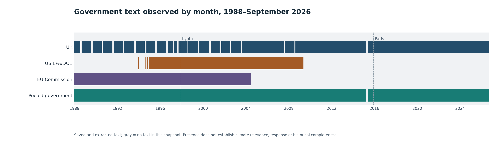

# International government corpus: temporal coverage and data shape

Snapshot assembled 27 September 2026 from existing read-only ledgers. Data sources have different update times and ongoing US/EU collection; this is a lower-bound view of saved text presence, not a final corpus freeze.

## Coverage

- Study months: **465** (1988-01 through 2026-09, final month partial). UK extracted text in **434**; EU extracted text in **198**; US usable text in **176** months in the source snapshots.
- Pooled government text presence: **463/465**. Months still lacking saved text in this snapshot: **2015-04, 2015-05**. The UK alone has **31** text-absent months.
- EU source Work enumeration is positive in **464/465** months. Enumeration is broader than downloaded and extracted text.
- This is government-role evidence only. Media/public corpora and validated warming/fear relevance are not yet represented in these acquisition ledgers. Time presence does not establish a real event response.

## Period distribution

| Period | Months | UK text months | US text months | EU text months | Pooled text months | UK independent records | EU enumerated Works |
|---|---:|---:|---:|---:|---:|---:|---:|
| 1988–1993 | 72 | 62 | 0 | 72 | 72 | 53,106 | 6,002 |
| 1994–2002 | 108 | 92 | 99 | 108 | 108 | 71,458 | 9,327 |
| 2003–2013 | 132 | 129 | 77 | 18 | 132 | 54,555 | 22,815 |
| 2014–2026* | 153 | 151 | 0 | 0 | 151 | 68,916 | 12,434 |

*2026 ends on 21 September. UK records and EU Works are different source units. US monthly counts are agency/genre stratum hits, so their sum can double-count a few cross-agency parents; month presence is unaffected. Do not add unlike record counts as an experiment sample size.*

## Event-window availability (government text only)

- Kyoto adoption, December 1997: **49/49** months from December 1995 through December 1999; absent: none. This is monthly text presence, not demonstrated climate-event response.
- Paris adoption, December 2015: **47/49** months from December 2013 through December 2017; absent: 2015-04, 2015-05. The live US/EU queues may change this snapshot.
- An event in 1988 cannot have 24 observed pre-event months within a study starting in January 1988.

## Current data shape

- UK 06 database: **248,035** document parents; **30,238** content objects; **250,093** parent/object links; **30,236** saved versions; **3,668,275** extracted text segments. These are different storage levels, not additive documents.
- UK genres: written answers **244,229** (98.47%); written statements **2,751**; policy records **1,055**. The pooled government series would otherwise be dominated by answers.
- US selected parent denominator: **33,544** unique EPA/DOE rulemaking records from 1994 onward; the 08:34 UTC audited report had **16,305** downloaded bodies. A later committed checkpoint reported 17,305, but it is not used to recalculate the older monthly CSV.
- EU selected source denominator: **50,578** unique Commission preparatory Works; **15,326** distinct Works had extracted text in the dated disposition ledger plus completed-month supervisor log. The active 2004-07 month is excluded until completion.
- Australia: **821** catalogue landing candidates; **17** saved content versions in the dated 09 report. Candidate landings and alternate versions are not verified independent monthly policy Works; exclude them from pooled text-presence counting here.
- Database `body_status` on older GOV.UK parents remains a historical ingestion-state field; the source content-version/segment and reviewed monthly ledgers supply the text-presence counts here. Do not interpret `blocked_pending_ethics_route` on those parent rows as proof that the later authorised content acquisition did not occur.

## Ledger timestamps

- UK monthly: 2026-09-23 01:21 UTC
- US monthly: 2026-09-27 08:34 UTC
- EU monthly: 2026-09-27 02:34 UTC
- EU text disposition: 2026-09-27 07:11 UTC
- EU supervisor log: 2026-09-27 10:50 UTC

The monthly CSV carries exact-month source presence and the evidence boundary for every study month. No full database re-import or fresh download was performed for this snapshot.
