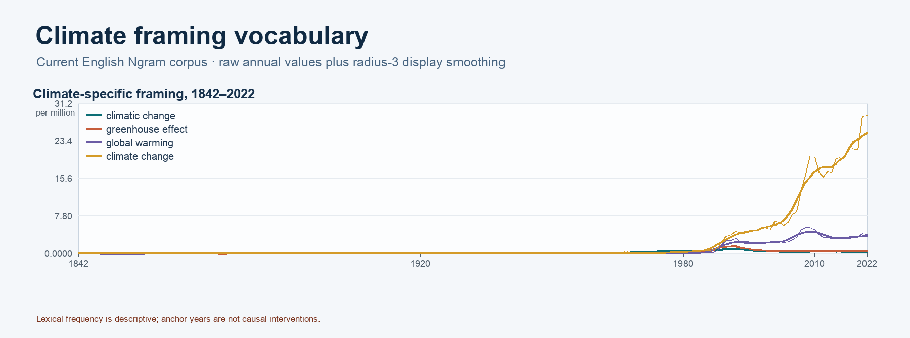
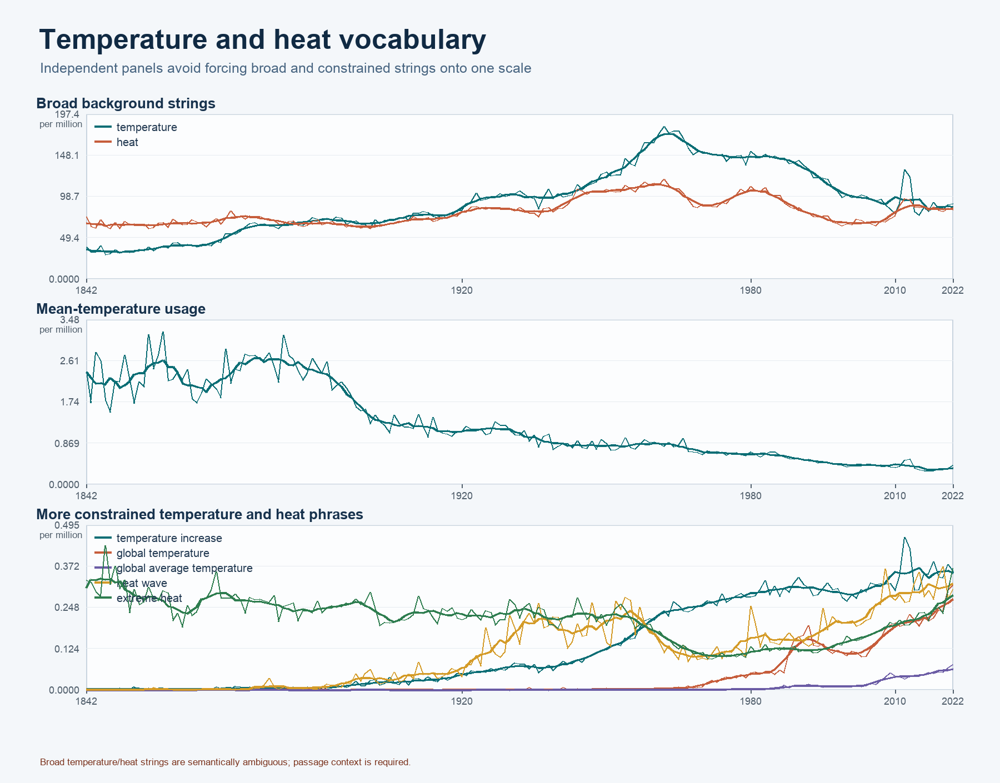
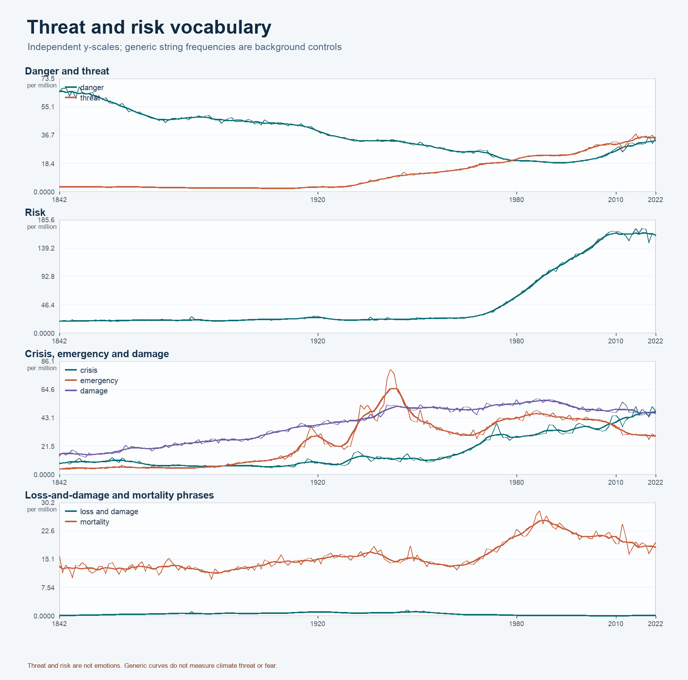
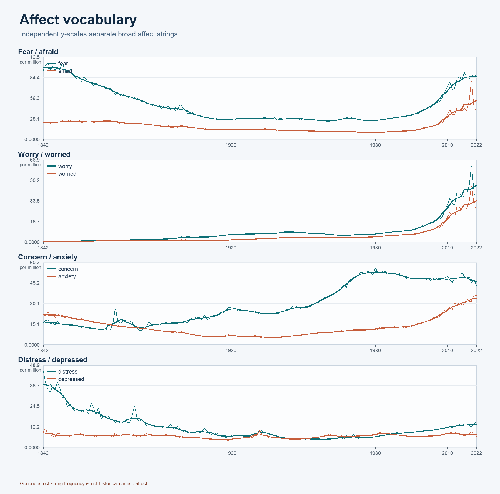
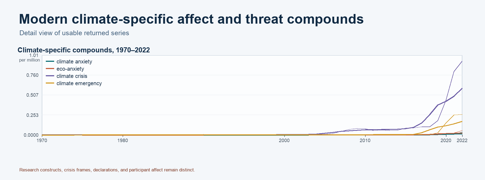

# Fear of Temperature — Quantitative Baseline v0.1

Status: **provisional, reproducible, and provenance-labelled**

Google Books Ngram interval: **1842–2022**

Research version: `fear-temperature-quant-v0.1-provisional`

## A. Current design

The study uses six historical anchors: 1842, 1938, 1988, 2006–2007, 2015, and 2022. They are analytical positions, not stages in a single progression from “no fear” to “fear.”

Lexical evidence is organised across four layers:

- A — temperature and physical phenomena;
- B — climate, atmosphere, and causation;
- C — affect;
- D — threat, risk, and harm.

Every future passage is also separated by speaker position: V1 scientific/research, V2 institutional/governance, V3 mediated public, V4 organised civic/advocacy, and V5 direct public/lay. Speaker and source matter because the same words can be measurements, causal claims, legal formulae, media instructions, survey prompts, participant responses, or researcher labels.

## B. What the historical lexical research suggests

- The 1842 materials separate temperature measurement from embodied heat experience. The phrase “depressing effect” is bodily and energetic in context, not modern clinical depression.
- The 1938 anchor links anthropogenic CO₂ and temperature scientifically, but does not establish public fear of that proposition.
- The 1988 evidence connects scientific warming to institutional threat and public-facing warning. Threat and security language are not treated as affect.
- The 2006–2007 anchor distinguishes media-prescribed worry from survey-elicited public worry; neither is spontaneous participant vocabulary by default.
- The 2015 anchor formalises temperature as a governance threshold. “Common concern of humankind” is a legal formula, not personal concern.
- The 2022 anchor includes explicit affect terminology, but researcher constructs, instrument wording, and participant self-description remain separate provenance categories.

The evidence-backed voice matrix retains thin and absent cells rather than filling them for symmetry. In particular, organised civic evidence is absent or thin in the earlier anchors, exact-1988 direct-public evidence is weak, and much contemporary direct-public affect is survey-elicited.

## C. Quantitative baseline

The provisional inventory contains **143 anchor-specific query rules**. The current public English Ngram interface made **138** rules executable; **132** returned non-zero annual series, **6** returned zero results, **5** were retained as incompatible/not-run, and **0** failed after retrieval. The resulting long-format dataset contains **23,892 raw annual observations** from 1842 through 2022. Retrieval used smoothing `0`; radius-3 smoothing appears only in chart-source CSVs.

Selected anchor values below are normalized occurrences per million words. The 2006–2007 column is an explicitly labelled two-year mean.

| String | 1842 | 1938 | 1988 | 2006–07 mean | 2015 | 2022 | Interval peak |
| --- | ---: | ---: | ---: | ---: | ---: | ---: | --- |
| climatic change | 0.000 | 0.055 | 0.610 | 0.353 | 0.309 | 0.356 | 1.085 (1990) |
| greenhouse effect | 0.000 | 0.010 | 1.086 | 0.495 | 0.416 | 0.453 | 1.961 (1990) |
| global warming | 0.000 | 0.002 | 0.640 | 4.178 | 3.294 | 3.964 | 5.446 (2009) |
| climate change | 0.005 | 0.003 | 1.241 | 10.954 | 19.671 | 28.900 | 28.900 (2022) |
| climate crisis | 0.000 | 0.000 | 0.002 | 0.031 | 0.087 | 0.939 | 0.939 (2022) |
| climate emergency | 0.000 | 0.000 | 0.000 | 0.001 | 0.006 | 0.263 | 0.263 (2022) |
| climate anxiety | 0.000 | 0.000 | 0.000 | 0.000 | 0.000 | 0.036 | 0.036 (2022) |
| eco-anxiety | 0.000 | 0.000 | 0.000 | 0.000 | 0.001 | 0.055 | 0.055 (2022) |

### Supervisor-ready findings

1. In this corpus, `climate change` rises from 1.241 occurrences per million in 1988 to 28.900 in 2022, reaching its interval maximum in 2022. This is a finding about the string, not about public fear.
2. `greenhouse effect` and `climatic change` both peak in 1990, while `global warming` peaks in 2009 and `climate change` peaks in 2022. The framing terms therefore have distinguishable trajectories.
3. The four modern compounds shown above all reach their interval maxima in 2022, but their absolute frequencies remain far below broad strings such as `temperature`, `heat`, `risk`, and `fear`.
4. Broad physical vocabulary is observable throughout the interval: `temperature` occurs in every retrieved year and peaks in 1962 at 182.778 per million. Its curve cannot identify climate-specific meaning without passages.
5. Very early isolated non-zero results for some modern-looking phrases demonstrate why corpus-observed presence must not be labelled historical coinage; those occurrences require source inspection.

### Key charts

The complete raw anchor matrix, contextual-window matrix, family summaries, full annual series, compatibility audit, and chart-source CSVs remain available alongside these figures.

## D. Important methodological warning

Google Books Ngram reports normalized frequency of character strings in a digitized book corpus. Generic string frequency is not climate-specific semantic frequency. In particular, overall uses of `fear`, `anxiety`, `concern`, `risk`, `threat`, `crisis`, `emergency`, `heat`, or `temperature` cannot be converted into a historical “fear index.”

Threat is not fear; risk is not emotion; legal concern is not personal concern. A media imperative does not establish audience reception, survey wording is not spontaneous participant vocabulary, and a researcher-defined construct is not participant self-labelling. Voice, source, sense, and quotation status must therefore be validated at passage level.

The corpus also has coverage and OCR limits, and its normalized values must not be summed across overlapping family members. Family outputs compare member trajectories; they do not create family-frequency totals.

## E. Next step

Build the **200-passage source-linked semantic retrieval pilot**, prioritising ambiguous and high-risk families. Each accepted passage should preserve source, document, surrounding context, lexical occurrence, semantic annotation, voice/expression mode, and review decision. Retrieval precision and provenance completeness should be measured before expanding the corpus.

## Slide-ready summary

### Three findings

- Climate-framing terms follow different trajectories: `greenhouse effect` and `climatic change` peak in 1990, `global warming` in 2009, and `climate change` in 2022.
- `climate change` rises from 1.241 per million in 1988 to 28.900 in 2022 in the current English Books corpus.
- Climate-specific affect/threat compounds remain comparatively rare but all four selected compounds peak in 2022.

### Three methodological safeguards

- Generic string frequency is never equated with climate-specific meaning or historical emotion.
- Threat/risk, media prescriptions, survey prompts, researcher labels, and participant-generated affect remain analytically distinct.
- Corpus first-observed year is not treated as coinage, and overlapping family members are never summed into an index.

### One next step

**200-passage semantic retrieval pilot.**

## Provenance note

The 396-record seed ledger and 143-rule query inventory are provisional reconstructions because original later-stage structured research artifacts were unavailable. New project IDs and `RECONSTRUCTED_FROM_REPORT` labels preserve that limitation. The baseline supports analysis and presentation, but it is not a final immutable production-data freeze.
