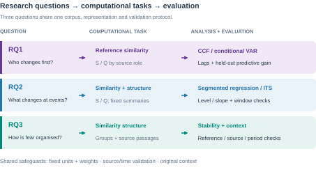
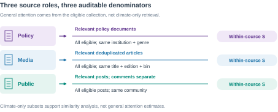
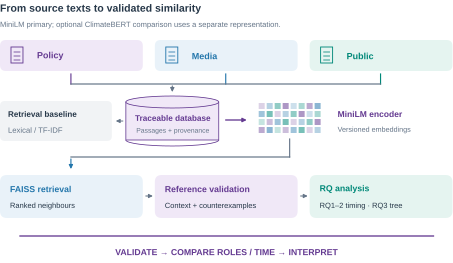
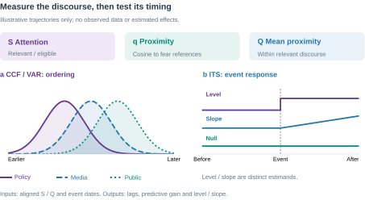
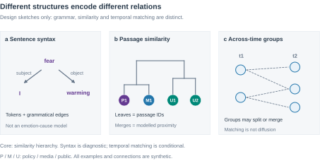

<!-- page: ai -->
# Use of AI Statement

**Topic exploration:** Yes; AI supported discussion of the topic and candidate approaches.

**Research questions:** Yes; AI assisted formulation and critique of Section 3.1; I selected the research focus.

**Literature review:** Yes; AI assisted searches and selected claim/reference checks for Section 2. Reading depth is recorded separately.

**Formatting and language:** Yes; AI assisted English drafting, translation, editing and document layout.

**Other uses:** Methodological discussion, planning, Figures 1-9 and export code. No empirical research-data analysis is reported here.

I acknowledge the use of generative AI tools in completing this assessment. Details of which tools were used and how they were used are provided in the table below, along with appropriate in-text and full references. I take responsibility for critically evaluating and integrating the AI-generated content, and ensuring it adheres to academic integrity standards.

**Table A. AI tool use.**

<!-- table: layout | 0.28,0.72 -->
| Tool and recorded use | Main activities |
|---|---|
| ChatGPT; 11 and 15 September 2026 | Topic and question development, literature assistance, methodological discussion, writing and language editing. |
| Gemini; date/version unrecorded | Suggested NLP modules and event/lag analysis; suggestions were assessed and revised by the author. |
| Codex; 15-16 September 2026 | Source and feasibility checks, discussion records, drafting, figures, export code and layout inspection. |

Tools: ChatGPT [@openai_chatgpt], Gemini [@google_gemini], Codex [@openai_codex]. Model versions are retained in the working record where available. This declaration concerns proposal preparation; it reports no empirical research-data analysis.

<!-- page: contents -->
# Contents

<!-- contents -->

## Figures and tables

**Figures:** 1. Research relationships; 2. Competing mechanisms; 3. RQ evidence routes; 4. Source denominators; 5. Reference validation; 6. Similarity workflow; 7. Temporal analysis; 8. Structural scales; 9. Calendar and workload.

**Tables:** A. AI use; 1. Literature synthesis; 2a-b. Sources and harmonisation; 3a-b. Measures and reference checks; 4. Events; 5. Structural alternatives; 6. Evaluation; 7. Risks; 8. OHS and ethics.

**Reading note.** This proposal reports planned research, not empirical findings. Access-dependent choices remain subject to the pilot.

<!-- page: introduction -->
# 1. Introduction

## 1.1 Motivation and significance

Rising temperature is both a physical process and an object of social anticipation. People may describe immediate danger during a heatwave, worry about the world their children will inherit, or assign responsibility for future disruption. These expressions involve different emotions, time horizons and social relationships. Climate-anxiety research recognises psychological responses to anticipated environmental change as well as direct exposure [@clayton2020]. Studying how such responses are communicated can illuminate the changing social meaning of warming without assuming that every negative statement expresses fear.

Fear of Temperature asks how warming-related fear and anxiety develop across government and policy discourse, news media and public expression. A central problem is temporal ordering: does public concern follow physical events, institutional communication or media attention, and when might it precede them? Earlier work links climate concern to political cues, media and other conditions [@brulle2012]. Research on affective agenda dynamics also demonstrates the relevance of comparing government, media and public expressions [@zhou2023]. Figure 1 frames these as competing relationships to investigate rather than a predetermined chain of influence.

## 1.2 A methodological transition

This study investigates warming-fear expressions through validated semantic similarity and structural analysis. Dictionary and n-gram exploration develops into traceable collection, pretrained embeddings and comparisons across roles/time. The thesis remains the main outcome.

Verified reference passages retain the focus on fear, including anticipated harm to families and future generations. Similarity retrieves candidates; contextual checks validate interpretation. Separate emotion classification and semantic-role extraction are outside scope. Lexical baselines test whether pretrained representations improve retrieval.

<!-- page: scope -->
## 1.3 Scope and historical framing

The core collection will prioritise English-language texts associated with the United States, European settings, Australia and New Zealand. Broad geographical coverage is an objective, while the main comparison concerns source roles and identifiable communities. Chinese-language material, East Asian settings and AOSIS members are extension candidates rather than dependencies of the core study. Publication location, author location and the place discussed in a text will be distinguished. English language alone will not establish geographic or cultural identity.

The target collection begins in January 1988 and extends to a documented cutoff in 2026. The establishment of the IPCC in 1988 motivates an institutional anchor [@ipcc_history]. It does not establish an emotional turning point. Recoverable material from 1938 onwards may form an earlier contextual layer, with Callendar's work providing a scientific-historical reference [@callendar1938]. A claim about change across 1988 requires adequate observations on both sides; the main collection alone cannot demonstrate that transition.

Historical span and analytical coverage are therefore different. Each comparison will use a sufficiently dense common window, with incomplete months, archive gaps and changes of source explicitly recorded. Letters to editors and early forums may extend the record of public expression, but their selection processes differ from contemporary platforms. The intended inference concerns the sampled discourse. Claims about population emotion require additional sampling or validation evidence.

Longer-term anticipated consequences are the substantive priority. Direct heat danger will be collected alongside them. Reference passages and validation notes distinguish threat, time horizon and affected group without requiring automatic corpus-wide emotion labels. Fear can concern the future, and collective anxiety can arise during a present emergency. Cultural heritage may inform discussion, but the project does not presuppose heritage status.

## 1.4 Broad aim and intended contribution

The broad aim is to understand how expressions of warming-related fear and anticipated harm are organised across policy, news and public discourse, and how their similarity and temporal relationships vary around physical and institutional events.

**Technical resource.** A versioned, traceable corpus and reproducible pipeline with documented coverage, denominators, sampling weights and a data dictionary. Code, configurations and random seeds will support reproduction; only permitted material will be released.

**Validated method.** An evaluated workflow connecting reference-guided semantic retrieval, similarity structure and temporal comparison, with lexical baselines and source/period checks. Any algorithmic novelty claim depends on demonstrated improvement, not simply combining existing models.

**Empirical contribution.** A thesis investigating the timing, convergence and organisation of warming-fear expressions through statistical estimates and contextual evidence, with explicit causal limits and potential for publication. Small or uncertain associations remain legitimate findings; success does not require a dominant driver or significant policy effect.

<!-- page: background -->
# 2. Background and Literature Review

## 2.1 Climate emotions and anticipated futures

Climate anxiety concerns responses to possible as well as experienced environmental harm. Clayton cautions against assuming that concern is necessarily maladaptive [@clayton2020]. Solastalgia instead describes distress associated with environmental change in a place to which people remain attached [@albrecht2007]. These accounts connect emotion to anticipated futures and lived environments, but neither makes all negative climate language equivalent to anxiety.

Pihkala's taxonomy distinguishes fear, worry, grief, anger, guilt and hope [@pihkala2022]. For this project, that diversity argues against a single scale running from bodily panic to existential anxiety. Reference selection and validation must distinguish emotional expression, target, time horizon and affected group. Textual worry does not establish a persistent psychological condition; keyword cues require contextual validation.

O'Neill and Nicholson-Cole distinguish fear-inducing climate imagery from effective engagement [@oneill2009]. Threatening representations need not indicate policy support. Validation must separate issue relevance, fear expression and agreement; similarity alone cannot resolve them. Textual expressions are not direct observations of population mental health.

## 2.2 Agenda-setting and responsibility frames

Agenda-setting addresses relationships between the prominence of issues in media and public agendas [@mccombs1972].  A corpus share, however, measures the prominence of an issue in sampled output; without audience information it does not measure exposure or establish whose agenda changed.

Framing concerns how communication selects a problem, causal interpretation, evaluation and response [@entman1993]. Increased climate coverage can frame warming as economic disruption, physical danger or intergenerational injustice. These are different interpretations even if their overall issue attention is similar. Cause, blame and response duty also differ: an actor may be asked to respond without being blamed for creating the problem. Contextual reading is therefore needed to interpret proximity: the project will not infer cause, blame or duty automatically from a similarity edge.

Similar policy and public language may reflect adoption, quotation or opposition; convergence alone does not establish agreement.

**Table 1. Literature and design.**

<!-- table: layout | 0.25,0.35,0.4 -->
| Evidence strand | What it contributes | Requirement for this study |
|---|---|---|
| Climate emotions | Multiple responses to threat | Verify fear, target and horizon |
| Agenda and framing | Prominence versus interpretation | Measure attention and narrative content |
| Climate concern | Elite/media and physical explanations | Compare roles and exposure scales |
| Contextual NLP | Retrieval and text representations | Validate by source and period |
| Temporal methods | Ordering and event-related changes | State estimands and causal limits |

<!-- page: mechanisms -->
## 2.3 Evidence from climate concern and role comparisons

Brulle and colleagues construct quarterly U.S. climate-concern measures from 74 surveys during 2002-2010, comparing weather, science information, media and political factors [@brulle2012]. Their findings motivate institutional explanations, but aggregate concern is not specifically future-oriented fear. National quarterly observations may also conceal responses to local, short-lived heat exposure. The proposed text measures add narrative detail and shorter eligible windows; they introduce selection and representation errors that survey-based concern does not share in the same form. They should complement this evidence rather than be assumed more accurate.

Zhou and colleagues compare public, government and media emotional communication on Weibo during COVID-19 [@zhou2023]. This is a close precedent for role-based temporal comparison, but one platform and a pandemic period differ from a historical climate corpus spanning institutions and media systems. The present design retains the role comparison while testing source continuity, emotional targets and independent physical observations. Neither precedent establishes that a fixed direction of influence applies across all periods.

## 2.4 Competing temporal mechanisms and expectations

Figure 2 summarises five competing expectations for RQ1. They concern sampled expressions, not population-level feelings, and may differ across periods.

**H1 — Institutional lead.** Elite signals can authorise a risk interpretation [@brulle2012]. If this mechanism operates, policy S/Q should precede media or public S/Q and add predictive information beyond their own histories and specified event controls. Publication timing must be distinguished from earlier announcements.

**H2 — Media lead.** Agenda-setting concerns prominence; framing concerns interpretation [@mccombs1972; @entman1993]. Media attention or reframing may precede public expression. Support would require media-leading patterns and conditional predictive gain, not merely similar vocabulary; aggregate texts cannot establish individual emotional contagion.

<!-- page: literature_methods -->
**H3 — Public lead.** Public expressions may become news material or pressure for institutional response. This project hypothesis extends role-comparison questions [@zhou2023]. Public-leading changes should predict later media/policy expression within comparable coverage; platform growth or repeated users must not generate the apparent lead.

**H4 — Common event.** A heat episode or scientific release may prompt all three roles. Near-synchronous changes and weaker cross-role prediction after event adjustment would be consistent with shared exposure. Monthly synchrony could also conceal faster ordering, so it cannot establish a common cause alone.

**H5 — Reciprocal response.** Roles may repeatedly respond to one another. Bidirectional conditional prediction and held-out gains would support a reciprocal temporal pattern. Shared shocks, quotation and omitted variables remain alternatives; VAR does not by itself demonstrate a social feedback mechanism [@shojaie2022].

## 2.5 Embeddings, semantic retrieval and structural analysis

Sentence-BERT supports efficient sentence comparison [@reimers2019]. The proposed primary encoder, all-MiniLM-L6-v2, maps sentences and short paragraphs to 384-dimensional vectors and is trained for sentence-level similarity. Its default 256-word-piece input limit makes passage segmentation essential [@minilm_card]. Similarity may recover paraphrases missed by exact words, but it is neither emotional intensity nor agreement. Lexical/TF-IDF retrieval will provide a transparent baseline.

ClimateBERT is a bounded domain-representation comparison, not a second mandatory model-development project. The candidate distilroberta-base-climate-f is a climate-adapted masked-language model; it is not automatically a sentence-similarity model [@climatebert_card]. Any comparison will specify the checkpoint, pooling and input treatment, then assess retrieval on the same judged passages. Its vectors will remain in a separate index; scores from different encoders will not be treated as directly interchangeable.

FAISS provides vector indexing and nearest-neighbour search [@faiss_docs]. It neither interprets fear nor builds the substantive relationship graph. A similarity-derived tree or graph represents proximity under chosen construction rules. Its branches are not observed pathways of influence. Actual reply or citation links, if available, are separate edge types rather than substitutes for semantic similarity.

Reviewed references connect retrieval to fear. Separate emotion classifiers, SRL and BERTopic remain outside scope; technical work centres on harmonisation, retrieval evaluation and structural comparison.

## 2.6 Selected research gap

The selected gap is the connection between changing discourse prominence and the organisation of warming-fear expressions across policy, media and public sources. Counts alone cannot show whether these roles use similar expressions of anticipated harm; proximity alone cannot establish that they express fear. This study connects verified fear/worry reference passages to evaluated retrieval, then compares similarity patterns and their timing within common coverage windows. Representative and contradictory passages support interpretation.

Granger analysis addresses prediction [@shojaie2022]; ITS estimates level/slope changes [@lopezbernal2017], not causality from time cutoffs alone [@hausman2018]. Source differences also complicate cross-lagged interpretations [@hamaker2015]. The contribution concerns expressions and structure, not population anxiety.

<!-- page: questions_pipeline -->
# 3. Project Plan

## 3.1 Research questions

**RQ1 - Who changes first?** How do policy, media and public warming-fear expressions converge or diverge over time, and which role changes first? Compare validated reference-similarity series using CCF and, where supported, conditional VAR with an own-history predictive baseline.

**RQ2 - What changes around events?** How do similarity distributions and supported structural summaries change around independently dated physical, scientific and policy events? Segmented regression/ITS tests prespecified scalar outcomes, with window sensitivity and placebo-date checks.

**RQ3 - How are fear expressions organised?** What groups and connections characterise warming-related fear and anticipated harm, and how are they reorganised across roles and time? A documented similarity structure and original passages support interpretation; stability checks test dependence on references and construction choices.

The focus remains anticipated warming harm. Similarity measures expression proximity, not psychological intensity.

## 3.2 Evidence-driven implementation

The bounded pilot tests collection, dates/roles, references, retrieval and one structural representation. Choose a common window by coverage; measured processing and review costs govern expansion.

Freeze references, encoder, units, weights, construction and outcomes before comparison. Retain baselines and counterexamples. ClimateBERT and wider coverage are extensions.

<!-- page: sources -->
## 3.3 Selected sources and acquisition sequence

The initial sources are GOV.UK, Guardian and the preferred Reddit application route. Table 2a fixes priorities, not access approval; wider geography follows a validated pilot.

**Table 2a. Selected sources and access gates.**

<!-- table: layout | 0.27,0.24,0.27,0.22 -->
| Source / priority | Role and route | Coverage / denominator | Current gate |
|---|---|---|---|
| GOV.UK / primary | Policy; Search + Content APIs | Institution/type/month; indexed documents | Metadata pilot verified; body pending |
| Guardian / primary | News; Open Platform API | Accessible dated articles; same filters without topic query | Key, rights and extraction check |
| Reddit / preferred | Public; Researchers programme | Approved community/window; posts and comments separate | Application; permitted processing route |
| Mastodon / fallback | Public; permitted instance/API | Verified window; no historic completeness assumed | Instance rights, access and counts |
| UNFCCC / IPCC | Policy / science context | Dated releases; not all-policy denominators | Item-level rights check |
| US/EU/AU/NZ archives; licensed news; letters/forums | Extension strata | Source-specific accessible windows | Added only after core validation |

GOV.UK has a public Search API [@govuk_search]. M1.1 verified nine July 2026 DEFRA policy-paper metadata records: a bounded document denominator, not verified historical coverage or body-use permission.

Guardian offers a dissertation developer route with article text and a 500-call/day limit [@guardian_access]; verify terms and all-topic counts. Reddit approval must cover processing/export and reviewer access [@reddit_research]. If unavailable, assess one permitted Mastodon community [@mastodon_timelines].

Freeze source selection before inspecting fear scores. The 1988-2026 collection target does not imply continuous analytical coverage.

<!-- page: harmonisation -->
## 3.4 Corpus normalisation and historical comparability

The principal risk is analytical harmonisation across policy, media and public material, not merely database normal forms. SQL or NoSQL may preserve heterogeneous raw records; all analytical batches must satisfy the same documented field, unit and provenance contract. Vector normalisation cannot make publication systems comparable.

**Table 2b. Cross-role and historical standards.**

<!-- table: layout | 0.22,0.47,0.31 -->
| Dimension | Prespecified rule | Failure response |
|---|---|---|
| Three source roles | Assign by publishing function; retain genre and scientific subtype | Mixed/unknown stays separate |
| Voice and attribution | Store quoted speaker independently of publishing role | Do not move quoted speech between series |
| Dates and versions | Preserve first publication, update and collection dates; use first publication for bins | Unknown date excluded from timed analysis |
| Units and weights | Documents for source counts; passages for embeddings; retain parent IDs | Average within document before equal-document Q |
| Duplicates / joint issues | Count each document once in pooled totals; retain all institution links | Fractional allocation when combining institution strata |
| Source mix | Freeze source/genre weights in common windows; report coverage | Compare fixed-source subsets; no silent backfill |
| Channel transitions | Register archive/platform/format breaks independently of scores | Separate periods unless overlap supports comparison |

Government means institutional policy output, media means editorial publication, and public means non-institutional expression in eligible community channels. Official accounts on social platforms retain an institutional role; news accounts retain media identity. Uncertain authorship remains unknown. IPCC assessment texts have a scientific subtype and cannot define all-government salience.

S uses native document/post units with matching denominators. For Q, score relevant passages, average within each document/post, then apply source sampling weights; this prevents long reports dominating solely through passage count. In Equations (1) and (3), i denotes a parent unit and the bar in Equation (3) its mean relevant-passage proximity; p in Equation (2) indexes passages. Other aggregation choices are declared sensitivity analyses.

Older newspapers, letters, forums and contemporary platforms will not be concatenated as interchangeable populations. A source-era register will record archive scope, editorial selection, article type, digitisation/OCR, platform rules and observed coverage. Select common monthly bins or shared non-overlapping quarters; missing coverage is not zero expression. Publication location is not an author's location.

The acceptance gate requires auditable role/date/unit mappings, deduplication and denominators for every analysed stratum. Historical volume below 100 flags review, not automatic exclusion: effective counts and uncertainty govern usable resolution. Use the channel-transition diagnostic in Section 3.7 and fixed-source comparisons; failed comparability narrows the window rather than being repaired by a numerical rescaling.

<!-- page: measures -->
## 3.5 Operational definitions and construct validity

### 3.5.1 Constructs and measurement

Warming-related fear/worry is the object. Immediate danger, family and social futures are overlapping retrieval perspectives, not clinical labels.

**Table 3a. Constructs and measures.**

<!-- table: layout | 0.21,0.41,0.38 -->
| Construct | Operational measure | Interpretation boundary |
|---|---|---|
| Attention S | Weighted warming-relevant share | Requires an eligible background denominator |
| Proximity q | Mean cosine to fixed fear references | Semantic proximity, not fear intensity |
| Temporal Q | Weighted mean q in relevant units | Conditional on source and retrieval coverage |
| Structure | Prespecified tree/graph summary | Constructed proximity, not diffusion |
| Context | Reviewed representative and contrary passages | Interpretation, not automatic attribution |

In Equation (1), U contains eligible parent documents/posts for source r and time t; w is the sampling weight and R the validated relevance decision. Fix the parent relevance rule: at least one qualifying passage. S requires issue-independent collection or known inclusion weights.

<!-- equation: attention -->
$$S_{rt}=\frac{\sum_{i\in\mathcal{U}_{rt}}w_i R_i}{\sum_{i\in\mathcal{U}_{rt}}w_i}\tag{1}$$

In Equation (2), z_p is a passage embedding and A the fixed fear/worry reference set. Balance references across concern perspectives; inspect prespecified subsets without selecting them to maximise temporal effects.

<!-- equation: emotion -->
$$q_p=\frac{1}{|\mathcal{A}|}\sum_{a\in\mathcal{A}}\cos(\boldsymbol{z}_p,\boldsymbol{z}_a)\tag{2}$$

<!-- equation: joint -->
$$Q_{rt}=\frac{\sum_{i\in\mathcal{U}_{rt}}w_i R_i \bar{q}_i}{\sum_{i\in\mathcal{U}_{rt}}w_i R_i}\tag{3}$$

In Equation (3), the bar averages relevant passage scores within parent i. Q is document-weighted proximity, not emotion prevalence. Empty denominators are missing; retrieved-only samples support conditional distributions, not all-text estimates. Raw genre scores cannot rank populations by fear.

### 3.5.2 Reference design and validation

**Emotion and cognition.** Fear denotes expressed threat-directed apprehension; anxiety denotes apprehension that can be diffuse or uncertain. Worry is future-oriented thinking about possible adverse outcomes and may accompany emotion. These overlap; neither wording nor time horizon alone supplies a clinical classification [@pihkala2022].

<!-- page: labels -->
**Target and horizon.** Anticipated harm is an imagined outcome, not an emotion. Future orientation requires tense, dates, conditions or contextual evidence; otherwise retain uncertainty. Immediate heat danger and future concern may co-occur. Factual danger alone is not fear.

**Voice and scope.** Separate publisher, quoted speaker and emotion-holder: reporting public anxiety does not imply institutional fear. Track negation scope: “not afraid” negates fear, but denying policy effectiveness may coexist with fear.

**Modality.** “If warming worsens, I fear…” can express current concern about a conditional future. Mark hypothetical/counterfactual emotion separately from asserted experience. Read parent context; unresolved target, holder or scope stays ambiguous. These rules support validation, not an added classifier.

Document reference selection; label synthetic examples. Exclude reference-source documents from tests; keep duplicate clusters together.

**Table 3b. Reference and counterexample checks (synthetic).**

<!-- table: layout | 0.39,0.29,0.32 -->
| Synthetic passage | Intended check | Interpretation boundary |
|---|---|---|
| I worry about my children's future. | Future concern | Climate context is missing |
| I fear warming will harm my children. | Warming-related anticipated harm | Candidate positive reference |
| The government said people should not panic. | Quotation and negated advice | Not government fear |
| Scientists warn heatwaves are deadly. | Risk-only counterexample | Danger is not expressed fear |
| If warming worsens, I fear our town will become unsafe. | Conditional anticipated harm | Present concern; future condition |
| I am not afraid of warming; I oppose this tax. | Negation and policy disagreement | Similar vocabulary can mislead |

Review retrieved and background passages for missed expressions.

Vary reference wording on development data, then freeze it. Failed contextual validation restricts claims to topical proximity; cosine scores cannot substitute for fear evidence.

<!-- page: extraction -->
## 3.6 Representation and retrieval

Use all-MiniLM-L6-v2 as the primary sentence encoder [@minilm_card], with lexical/TF-IDF retrieval as a baseline. Segment long texts before encoding and preserve parent-document context. Freeze model revision, pooling, passage rules and reference vectors within each comparison. Unit-length vector normalisation supports cosine computation; it does not harmonise dates, source populations or sampling denominators.

**Retrieval.** Encode queries/references with the same encoder as corpus passages. FAISS indexes vectors and returns neighbours [@faiss_docs]. Start with exact search on the bounded pilot; approximate indexing is a scale option whose neighbour recovery must be checked against exact results. Record throughput, memory and runtime. ClimateBERT is a separate, optional representation comparison with documented pooling and the same evaluation material [@climatebert_card].

**RQ3 hand-off.** Validated passage embeddings and provenance supply the tree-based analysis in Section 3.7.4 (Figure 8 and Table 5). Tree construction belongs to that research question, rather than being a prerequisite for RQ1/RQ2 time-series analysis. FAISS index-internal connections are not discourse relationships.

No separate emotion classifier, SRL system or topic model is a core deliverable. Human review is bounded validation and contextual interpretation, not exhaustive manual coding.

## 3.7 Temporal and structural analysis

### 3.7.1 RQ1 and RQ2: temporal estimands

Use common monthly coverage or shared quarters; recompute ratios from counts. GISTEMP describes climate background; station/ERA5 data address local exposure [@gistemp; @era5]. Publication location does not establish exposure.

<!-- page: temporal -->
**RQ1: ordering and conditional prediction.** Equation (4) correlates processed, coverage-matched series; positive k means X precedes Y.

<!-- equation: ccf -->
$$C_{XY}(k)=\operatorname{Corr}\,\left(X_t,\,Y_{t+k}\right)\tag{4}$$

Conditional VAR tests added prediction beyond own history [@shojaie2022], subject to the diagnostic gates below.

**RQ2: event-associated change.** Segmented regression/interrupted time series (ITS) estimates level and slope changes [@lopezbernal2017]. In Equation (5), t is centred on onset and D switches from 0 to 1; β₂ and β₃ estimate level and slope changes. Diagnose serial dependence in u and adjust uncertainty.

<!-- equation: its -->
$$Y_t=\beta_0+\beta_1t+\beta_2D_t+\beta_3(tD_t)+u_t\tag{5}$$

### 3.7.2 Model specification and diagnostic gates

**Coverage and missingness.** Keep contiguous eligible calendar windows; never fill source gaps with zeros or compress time. A complete background bin can have S=0, but Q is undefined without relevant items. Report exclusions; use defensible common aggregation.

**Trends and seasonality.** Inspect series, seasonal patterns and stationarity diagnostics before CCF/VAR. For these analyses, remove supported deterministic trends/calendar effects; difference only if needed and interpret changes accordingly. Fit transformations on training data. ITS retains its explicit time, event and post-event trend terms [@lopezbernal2017].

<!-- page: events -->
**Variables and lags.** Use Q as primary and S separately, with one series per role. Prespecify monthly CCF lags −6 to +6 and VAR orders 1–3; freeze frequency-adjusted alternatives in calendar time. Select by training-set BIC and diagnostic adequacy [@statsmodels_var]. Compare one-step predictions with own-history on identical holdout dates/controls; CCF scans remain descriptive.

**Residuals and uncertainty.** Inspect residual autocorrelation and changing variance. ITS may use autocorrelation/heteroskedasticity-robust uncertainty when sample size permits. VAR requires stable dynamics and adequate residual diagnostics; invalid textbook tests are withheld. Simplify or report descriptive findings when checks fail. Robust standard errors cannot repair non-stationarity.

**Multiplicity and inference.** Prespecify the primary measure/window and correct each declared family of directional or event tests using Holm adjustment. Report effect sizes, intervals, all tested directions and held-out prediction gains; other scans are exploratory. Prediction does not establish causation [@shojaie2022]. Non-significance neither establishes no influence nor identifies an alternative driver.

### 3.7.3 Event selection and channel diagnostics

Select events independently of outcomes; distinguish announcements, adoption and implementation.

**Table 4. Candidate events.**

<!-- table: layout | 0.26,0.2,0.27,0.27 -->
| Candidate / type | External date | Window / outcome | Comparison and limit |
|---|---|---|---|
| Kyoto adoption / policy | 11 Dec 1997 | Initially ±6 months; S/Q level and slope | Historical overlap unverified |
| Paris adoption / policy | 12 Dec 2015 | Initially ±6 months; S/Q level and slope | Anticipation; concurrent coverage |
| Heat episode / physical | ○ Independent onset, peak and end | Dense local window; reference proximity | Matched exposure; seasonality |
| IPCC release / scientific | ○ Report-specific release date | Common coverage; S/Q or fixed structure summary | Shared shock; media spillover |

Adoption dates follow UNFCCC records [@unfccc_kyoto; @unfccc_paris]. A ±6-month monthly window provides only about 13 observations: it is an initial inspection window, not an adequate default ITS sample. Extend coverage before modelling trend, seasonality and dependence; otherwise report descriptive contrasts. Freeze windows from coverage and design requirements before examining event effects.

Controls require comparable pre-trends and different exposure. Register overlapping shocks; inseparable events share a window. Placebo dates assess sensitivity, not causal identification [@hausman2018].

**Channel-transition diagnostic.** Apply Equation (5) to documented channel transitions with comparable observations on both sides. Compare S/Q changes with fixed-source subsets. Coincident jumps flag composition bias; without overlap, analyse eras separately.

<!-- page: topology -->
### 3.7.4 RQ3: tree-based organisation and interpretation

Interpret matched groups using representative and contrary passages; similarity does not establish influence or responsibility.

The capped, source-balanced RQ3 pilot uses average-linkage cosine dissimilarity [@scipy_linkage]. Retain passage IDs and duplicate clusters; test resampling stability and freeze the cut rule. A sparse graph is the resource fallback; observed replies/citations remain separate edge types.

**Table 5. Structural alternatives and scope.**

<!-- table: layout | 0.23,0.41,0.36 -->
| Method | Nodes / relation and use | Commitment / limitation |
|---|---|---|
| Similarity hierarchy | Passages; average-linkage cosine proximity | Core pilot; quadratic distance cost |
| Dependency tree | Tokens; grammatical dependencies | Optional difficult-case check; not emotion attribution |
| Constituency tree | Phrases; syntactic containment | Optional scope check; parser errors remain |
| WordNet / ontology | Word senses; lexical/concept relations | Vocabulary aid; not an eco-anxiety taxonomy |
| Causal event tree | Event, harm, expression; claimed narrative links | Outside core; needs separate evidence/annotation |
| Topic/group evolution | Groups across time; matched representations | Conditional extension; splits/merges form a graph |

Parsers support optional attachment, negation and quotation checks [@stanza_dependency; @stanza_constituency], not emotional attribution. WordNet supplies lexical relations [@wordnet], not an eco-anxiety taxonomy.

Temporal matching retains unmatched groups under fixed rules; splits/merges do not prove diffusion. Causal trees require narrative evidence. Only the similarity hierarchy is core; extensions require demonstrated need and capacity.

<!-- page: evaluation -->
## 3.8 Evaluation and validity

A role-balanced development batch of approximately 150 passages will estimate ambiguity and review costs, not final performance. Define relevance to the fear/worry reference perspectives, including risk-only and negated counterexamples. Size a separate source/period-stratified test set from the pilot budget and desired precision. Record enrichment and assess background misses.

Recruit an independent reader unfamiliar with the project, who did not select references or develop models. Provide a neutral task guide, but conceal preferred hypotheses, model identity and the author's initial judgements where feasible. The supervisor is not the sole validation reader. Record agreement and disagreements before discussion. If unavailable, report single-reader checking and restrict claims. Split by document/duplicate cluster; exclude reference-source material.

**Table 6. Evaluation plan.**

<!-- table: layout | 0.16,0.18,0.24,0.19,0.23 -->
| Task | Baseline / reference | Comparison | Metric / output | Validation setting |
|---|---|---|---|---|
| Retrieval | Lexical / TF-IDF | MiniLM; optional ClimateBERT | Precision@k; nDCG@k | Held-out query/passage judgements |
| Construct link | Contextual judgement | References and counterexamples | False matches; missed expressions | Source/period audit; background sample |
| Structure | Fixed construction | Limited parameter/resampling checks | Neighbour/group stability | Matched coverage and sample size |
| RQ1 | Own-history model | Conditional VAR + roles | Held-out MSE gain; lag uncertainty | Common window; chronological holdout |
| RQ2 | Pre-event trend | Segmented regression / ITS | Level/slope; uncertainty | Fixed outcomes; placebo dates |
| RQ3 | Original passages | Structural groups and contrasts | Supported interpretations | Representative and contrary evidence |

Ranked evaluation needs documented relevance judgements. Recall will only be reported where sufficiently complete relevant-item judgements support its denominator; a reviewed top-k list alone does not establish full-corpus recall. Retrieval scores do not validate fear intensity. Any approximate FAISS search is separately checked for neighbour recovery against exact search.

Use reference-set sensitivity, resampling and source/period checks to assess whether conclusions survive representation and construction choices. Unreliable fear-related distinctions trigger revised references or narrower claims, not automatic replacement with an unvalidated cosine score. Account for source, time, author and duplicate dependence.

Freeze outcomes, thresholds, weights and lag ranges before final comparisons; alternatives remain sensitivity/exploratory analyses. Non-significance proves neither absent physical influence nor exclusive policy control [@wasserstein2016].

<!-- page: risks -->
## 3.9 Project risks and scope adjustment

Each risk has one failure condition and response; interacting risks are not assumed statistically independent. R1 is the primary priority. High threatens the core study or deadline; Medium has a bounded fallback; Low does not require action. Rows are grouped in descending priority.

**Table 7. Atomic risks, triggers and responses.**

<!-- table: layout | 0.24,0.27,0.49 -->
| Risk | Trigger | Response |
|---|---|---|
| **HIGH · R1–R10** |  |  |
| R1. Cross-role harmonisation | Mappings violate common contract | Apply Table 2b; separate incompatible strata. |
| R2. Historical channel change | Source turnover coincides with change | Register transitions; fixed-source checks; separate non-overlapping eras. |
| R3. Corpus construction delay | Forecast misses 18 Dec freeze | Reduce sources/time span; freeze a complete bounded core. |
| R4. Model suitability | Held-out fear relevance fails | Audit errors; compare lexical baseline; restrict unsupported claims. |
| R5. Fine-tuning overrun | Written tuning allowance exceeded | Stop optional tuning; retain a validated frozen model. |
| R6. Integration conflict | Upstream revision breaks outputs | Version interfaces; integration checks; rebuild affected descendants. |
| R7. Ethics clearance | UQ pathway remains unresolved | Pause affected use; seek review/exemption determination. |
| R8. Source access denial | Preferred acquisition route denied | Assess permitted Mastodon alternative; narrow public comparison. |
| R9. Insufficient coverage | Compatible observations too sparse | Use defensible common quarters or shorten comparison window. |
| R10. Measurement failure | Construct/stability checks fail | Rollback measure; revise; validate on fresh held-out evidence. |
| **MEDIUM · R11–R16** |  |  |
| R11. Analysis specification | Time-series diagnostics fail | Rollback analysis; simplify; use descriptive findings if needed. |
| R12. Compute capacity | Measured memory/runtime exceeded | Cap balanced sample; batch encoding; assess sparse graph. |
| R13. Independent review | Eligible reader unavailable | Recruit early; disclose single-reader limits if necessary. |
| R14. Release restrictions | Redistribution terms prohibit outputs | Release permitted code/IDs/aggregates; control restricted artefacts. |
| R15. Personal disruption | Availability consumes schedule buffer | Use contingency; defer optional comparisons. |
| R16. Artefact loss | Files corrupted or restore fails | Restore tested backups; rerun verified checkpoint. |
| **LOW · R17** |  |  |
| R17. Better model release | New checkpoint after freeze | Log for future work; keep validated encoder. |

R7 concerns ethics clearance, R8 acquisition access and R14 redistribution. R10 concerns invalid measurement; R11 concerns analysis assumptions. Versioned checkpoints link records → units → vectors → scores/structure → estimates. Rollback follows failed checks, never unwanted results; post-outcome redesign is exploratory and requires fresh validation. Schedule gates follow in Section 3.10.

<!-- page: timetable -->
## 3.10 Milestones, resources and time allocation

At 10-20 hours/week, the provisional budget is 450-590 hours plus 15% contingency. All analysis and robustness checks must finish by 28 February 2027. The 320-400 hours allocated before March require about 14-17 hours/week before contingency; sustained lower capacity will trigger early scope reduction.

Resource dependencies are permitted archives, storage/local compute, annotation time and supervisory feedback. The pilot is due by 16 October; core data and denominator checks freeze on 18 December. Measurement validation freezes on 15 January, followed by all temporal, event and structural analyses by 28 February. Release requires a permissions review and reproduction instructions.

Assessment anchors: seminar, 12-16 October; Thesis Plan, 1-19 March 2027; rehearsal, 10-14 May; final pitch/poster/demonstration/Q&A, 7-11 June. March-June centres on writing and feedback using completed analyses.

Missed freezes trigger narrower comparisons while preserving construct validation, a bounded cross-role comparison and the February target.

<!-- page: ethics -->
## 3.11 OHS, ethics and data governance

All proposed human-language sources and derived databases will undergo documented ethics screening before substantive use. This project commitment covers public policy/news, public posts, quotations, identifiers, embeddings, indices and release plans; public availability is not blanket permission.

**Table 8. Human-data and OHS controls.**

<!-- table: layout | 0.24,0.44,0.32 -->
| Issue | Project control | Residual check |
|---|---|---|
| Identifiability | Minimise identifiers; restrict originals and exact quotations | Searchable text may re-identify people |
| Derived data | Screen embeddings, indices, linkage and releases | Transformation is not automatic anonymisation |
| Independent review | Neutral guide; separate initial judgements | Reader needs permitted data access |
| Group representation | Observable roles; unknowns retained | No inferred sensitive identities |
| Workload / wellbeing | Bounded reading sessions, breaks and ergonomic setup | Monitor fatigue/distressing content |

**Institutional pathway.** UQ requires research involving or about humans or their data to undergo ethics review or qualify for exemption. Determine the route with Research Ethics and Integrity; submit review or applicable exemption registration through MyResearch. Begin relevant work only when approval or exemption conditions are established. Because publication is intended, do not rely on a training-only exemption. Not every public institutional document necessarily requires HREC review; the applicable pathway must be documented [@uq_ethics]. No clearance is claimed here.

**Independent methodological review.** Use a reader unfamiliar with the project and uninvolved in selecting references or models. They receive enough neutral instruction to assess passages, but not the preferred result or initial labels. This reduces investigator expectancy; the supervisor's oversight does not substitute for independent validation. Nor can either reader or supervisor replace institutional ethics determination. Reddit source access, including access for an independent reader, requires its own permission [@reddit_research].

**Later human evaluation.** If reviewer behaviour, A/B responses or other participant data become research outcomes, seek UQ advice on the participant role and any approval/amendment before recruitment. Document consent and permitted processing. Separate ethical clearance from copyright, platform terms and storage/export permissions; none substitutes for the others.

## 3.12 Outputs and research record

Release only permitted data/code with provenance, role/time keys, units, missingness, reference/model versions, edge definitions and uncertainty. Restricted originals remain separate. A dependency manifest and rollback log support reproduction; the thesis links temporal/structural findings to representative and contradictory passages. Independent review and supervisory feedback are recorded separately.

<!-- page: references -->
# References

<!-- bibliography -->

