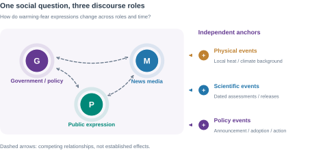
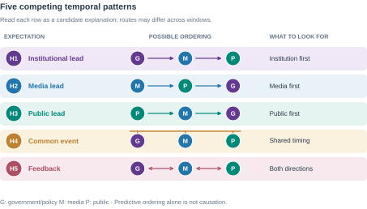
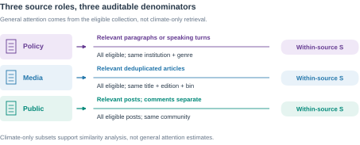
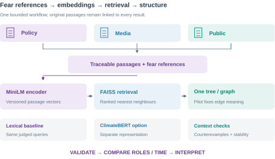
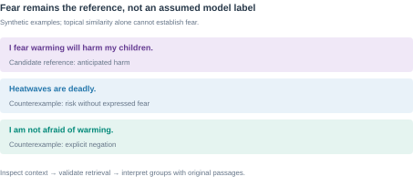
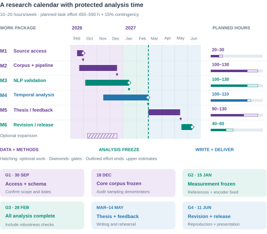

<!-- page: ai -->
# Use of AI Statement

**Topic exploration:** Yes; AI supported discussion of the topic and candidate approaches.

**Research questions:** Yes; AI assisted formulation and critique of Section 3.1; I selected the research focus.

**Literature review:** Yes; AI assisted searches and selected claim/reference checks for Section 2. Reading depth is recorded separately.

**Formatting and language:** Yes; AI assisted English drafting, translation, editing and document layout.

**Other uses:** Methodological discussion, planning, Figures 1-8 and export code. No empirical research-data analysis is reported here.

I acknowledge the use of generative AI tools in completing this assessment. Details of which tools were used and how they were used are provided in the table below, along with appropriate in-text and full references. I take responsibility for critically evaluating and integrating the AI-generated content, and ensuring it adheres to academic integrity standards.

<!-- table: ai | 0.28,0.72 -->
**Table A. AI tool use.**

| Tool and recorded use | Main activities |
|---|---|
| ChatGPT; 11 and 15 September 2026 | Topic and question development, literature assistance, methodological discussion, writing and language editing. |
| Gemini; date/version unrecorded | Suggested NLP modules and event/lag analysis; suggestions were assessed and revised by the author. |
| Codex; 15-16 September 2026 | Source and feasibility checks, discussion records, drafting, figures, export code and layout inspection. |

Tools: ChatGPT [@openai_chatgpt], Gemini [@google_gemini], Codex [@openai_codex]. Model versions are retained in the working record where available. This declaration concerns proposal preparation; it reports no empirical research-data analysis.

<!-- page: contents -->
# Contents

<!-- contents -->

## Figures and tables

**Figures:** 1. Research relationships; 2. Competing mechanisms; 3. RQ evidence routes; 4. Source denominators; 5. NLP pipeline; 6. Measurement and timing; 7. Contextual evidence; 8. Calendar and workload.

**Tables:** A. AI use; 1. Literature synthesis; 2. Source register; 3a-b. Measures and reference checks; 4. Event plan; 5. Evaluation; 6. Risk assessment; 7. OHS and ethics.

**Reading note.** This proposal describes planned research; it does not report completed experiments. Numerical examples and diagram trajectories explain the design. Access-dependent choices will be resolved through the documented pilot. The provisional submission date is 16 September 2026; the course deadline is 17 September 2026 at 15:00.

<!-- page: introduction -->
# 1. Introduction
## 1.1 Motivation and significance

Rising temperature is both a physical process and an object of social anticipation. People may describe immediate danger during a heatwave, worry about the world their children will inherit, or assign responsibility for future disruption. These expressions involve different emotions, time horizons and social relationships. Climate-anxiety research recognises psychological responses to anticipated environmental change as well as direct exposure [@clayton2020]. Studying how such responses are communicated can illuminate the changing social meaning of warming without assuming that every negative statement expresses fear.

Fear of Temperature asks how warming-related fear and anxiety develop across government and policy discourse, news media and public expression. A central problem is temporal ordering: does public concern follow physical events, institutional communication or media attention, and when might it precede them? Earlier work links climate concern to political cues, media and other conditions [@brulle2012]. Research on affective agenda dynamics also demonstrates the relevance of comparing government, media and public expressions [@zhou2023]. Figure 1 frames these as competing relationships to investigate rather than a predetermined chain of influence.

## 1.2 A methodological transition

This study investigates warming-fear expressions through validated semantic similarity and structural analysis. Dictionary and n-gram exploration develops into traceable collection, pretrained embeddings and comparisons across roles/time. The thesis remains the main outcome.

Verified reference passages retain the focus on fear, including anticipated harm to families and future generations. Similarity retrieves candidates; contextual checks validate interpretation. Separate emotion classification and semantic-role extraction are outside scope. Lexical baselines test whether pretrained representations improve retrieval.

<!-- page: scope -->
## 1.3 Scope and historical framing

The core collection will prioritise English-language texts associated with the United States, European settings, Australia and New Zealand. Broad geographical coverage is an objective, while the main comparison concerns source roles and identifiable communities. Chinese-language material, East Asian settings and AOSIS members are extension candidates rather than dependencies of the core study. Publication location, author location and the place discussed in a text will be distinguished. English language alone will not establish geographic or cultural identity.

The target collection begins in January 1988 and extends to a documented cutoff in 2026. The establishment of the IPCC in 1988 motivates an institutional anchor [@ipcc_history]. It does not establish an emotional turning point. Recoverable material from 1938 onwards may form an earlier contextual layer, with Callendar's work providing a scientific-historical reference [@callendar1938]. A claim about change across 1988 requires adequate observations on both sides; the main collection alone cannot demonstrate that transition.

Historical span and analytical coverage are therefore different. Each comparison will use a sufficiently dense common window, with incomplete months, archive gaps and changes of source explicitly recorded. Letters to editors and early forums may extend the record of public expression, but their selection processes differ from contemporary platforms. The intended inference concerns the sampled discourse. Claims about population emotion require additional sampling or validation evidence.

Longer-term anticipated consequences are the substantive priority. Direct heat danger will be collected alongside them. Reference passages and validation notes distinguish threat, time horizon and affected group without requiring automatic corpus-wide emotion labels. Fear can concern the future, and collective anxiety can arise during a present emergency. Cultural heritage may inform discussion, but the project does not presuppose heritage status.

## 1.4 Broad aim and intended contribution

The broad aim is to understand how expressions of warming-related fear and anticipated harm are organised across policy, news and public discourse, and how their similarity and temporal relationships vary around physical and institutional events.

**Technical resource.** A versioned, traceable corpus and reproducible pipeline with documented coverage, denominators, sampling weights and a data dictionary. Code, configurations and random seeds will support reproduction; only permitted material will be released.

**Validated method.** An evaluated workflow connecting reference-guided semantic retrieval, similarity structure and temporal comparison, with lexical baselines and source/period checks. Any algorithmic novelty claim depends on demonstrated improvement, not simply combining existing models.

**Empirical contribution.** A thesis investigating the timing, convergence and organisation of warming-fear expressions through statistical estimates and contextual evidence, with explicit causal limits and potential for publication. Small or uncertain associations remain legitimate findings; success does not require a dominant driver or significant policy effect.

<!-- page: background -->
# 2. Background and Literature Review
## 2.1 Climate emotions and anticipated futures

Climate anxiety concerns responses to possible as well as experienced environmental harm. Clayton cautions against assuming that concern is necessarily maladaptive [@clayton2020]. Solastalgia instead describes distress associated with environmental change in a place to which people remain attached [@albrecht2007]. These accounts connect emotion to anticipated futures and lived environments, but neither makes all negative climate language equivalent to anxiety. 

Pihkala's taxonomy distinguishes fear, worry, grief, anger, guilt and hope [@pihkala2022]. For this project, that diversity argues against a single scale running from bodily panic to existential anxiety. Reference selection and validation must distinguish emotional expression, target, time horizon and affected group. Textual worry does not establish a persistent psychological condition; keyword cues require contextual validation.

O'Neill and Nicholson-Cole distinguish fear-inducing climate imagery from effective engagement [@oneill2009]. Threatening representations need not indicate policy support. Validation must separate issue relevance, fear expression and agreement; similarity alone cannot resolve them. Textual expressions are not direct observations of population mental health.

## 2.2 Agenda-setting and responsibility frames

Agenda-setting addresses relationships between the prominence of issues in media and public agendas [@mccombs1972].  A corpus share, however, measures the prominence of an issue in sampled output; without audience information it does not measure exposure or establish whose agenda changed.

Framing concerns how communication selects a problem, causal interpretation, evaluation and response [@entman1993]. Increased climate coverage can frame warming as economic disruption, physical danger or intergenerational injustice. These are different interpretations even if their overall issue attention is similar. Cause, blame and response duty also differ: an actor may be asked to respond without being blamed for creating the problem. Contextual reading is therefore needed to interpret proximity: the project will not infer cause, blame or duty automatically from a similarity edge.

Similar policy and public language may reflect adoption, quotation or opposition; convergence alone does not establish agreement.

<!-- table: literature | 0.25,0.35,0.40 -->
**Table 1. Literature and design.**

| Evidence strand | What it contributes | Requirement for this study |
|---|---|---|
| Climate emotions | Multiple responses to threat | Verify fear, target and horizon |
| Agenda and framing | Prominence versus interpretation | Measure attention and narrative content |
| Climate concern | Elite/media and physical explanations | Compare roles and exposure scales |
| Contextual NLP | Retrieval and text representations | Validate by source and period |
| Temporal methods | Ordering and event-related changes | State estimands and causal limits |

<!-- page: mechanisms -->
## 2.3 Evidence from climate concern and role comparisons

Brulle and colleagues construct quarterly U.S. climate-concern measures from 74 surveys during 2002-2010, comparing weather, science information, media and political factors [@brulle2012]. Their findings motivate institutional explanations, but aggregate concern is not specifically future-oriented fear. National quarterly observations may also conceal responses to local, short-lived heat exposure. The proposed text measures add narrative detail and shorter eligible windows; they introduce selection and representation errors that survey-based concern does not share in the same form. They should complement this evidence rather than be assumed more accurate.

Zhou and colleagues compare public, government and media emotional communication on Weibo during COVID-19 [@zhou2023]. This is a close precedent for role-based temporal comparison, but one platform and a pandemic period differ from a historical climate corpus spanning institutions and media systems. The present design retains the role comparison while testing source continuity, emotional targets and independent physical observations. Neither precedent establishes that a fixed direction of influence applies across all periods.

## 2.4 Competing temporal mechanisms and expectations

Institutional signals can supply authoritative risk interpretations [@brulle2012]; media can select and frame issues [@mccombs1972; @entman1993]; public expression may supply news material and pressure for response. Figure 2 makes the competing temporal expectations visible. H3 is a project hypothesis informed by role-comparison research [@zhou2023], not an established climate result.

The same ordering can arise from anticipation, shared releases, reposting or changing participants. A coarse monthly bin can hide a faster ordering. Local heat exposure also differs from global climate background. These expectations may coexist across windows; temporal prediction alone cannot identify social feedback or individual emotional contagion.

<!-- page: literature_methods -->
## 2.5 Embeddings, semantic retrieval and structural analysis

Sentence-BERT supports efficient sentence comparison [@reimers2019]. The proposed primary encoder, all-MiniLM-L6-v2, maps sentences and short paragraphs to 384-dimensional vectors and is trained for sentence-level similarity. Its default 256-word-piece input limit makes passage segmentation essential [@minilm_card]. Similarity may recover paraphrases missed by exact words, but it is neither emotional intensity nor agreement. Lexical/TF-IDF retrieval will provide a transparent baseline.

ClimateBERT is a bounded domain-representation comparison, not a second mandatory model-development project. The candidate distilroberta-base-climate-f is a climate-adapted masked-language model; it is not automatically a sentence-similarity model [@climatebert_card]. Any comparison will specify the checkpoint, pooling and input treatment, then assess retrieval on the same judged passages. Its vectors will remain in a separate index; scores from different encoders will not be treated as directly interchangeable.

FAISS provides vector indexing and nearest-neighbour search [@faiss_docs]. It neither interprets fear nor builds the substantive relationship graph. A similarity-derived tree or graph represents proximity under chosen construction rules. Its branches are not observed pathways of influence. Actual reply or citation links, if available, are separate edge types rather than substitutes for semantic similarity.

A limited reference set and explicit counterexamples connect representation to the social question. Contextual checking is retained, while independent emotion classifiers, SRL, automatic responsibility extraction and BERTopic are outside the core implementation. The main technical work is corpus harmonisation, retrieval evaluation and reliable structural comparison rather than training a new language model.

## 2.6 Selected research gap

The selected gap is the connection between changing discourse prominence and the organisation of warming-fear expressions across policy, media and public sources. Counts alone cannot show whether these roles use similar expressions of anticipated harm; proximity alone cannot establish that they express fear. This study connects verified fear/worry reference passages to evaluated retrieval, then compares similarity patterns and their timing within common coverage windows. Representative and contradictory passages support interpretation.

Temporal models address bounded questions. Granger analysis concerns added prediction [@shojaie2022]; ITS estimates level and slope changes [@lopezbernal2017], while a temporal cutoff alone does not identify a causal effect [@hausman2018]. Stable source differences also complicate cross-lagged interpretations [@hamaker2015]. The contribution is a reproducible empirical analysis of expression and structure, not proof of population anxiety or an assumed direction of influence.

<!-- page: questions_pipeline -->
# 3. Project Plan
## 3.1 Research questions

**RQ1 - Who changes first?** How do policy, media and public warming-fear expressions converge or diverge over time, and which role changes first? Compare validated reference-similarity series using CCF and, where supported, conditional VAR with an own-history predictive baseline.

**RQ2 - What changes around events?** How do similarity distributions and supported structural summaries change around independently dated physical, scientific and policy events? Segmented regression/ITS tests prespecified scalar outcomes, with window sensitivity and placebo-date checks.

**RQ3 - How are fear expressions organised?** What groups and connections characterise warming-related fear and anticipated harm, and how are they reorganised across roles and time? A documented similarity structure and original passages support interpretation; stability checks test dependence on references and construction choices.

The focus remains anticipated warming harm. Similarity measures expression proximity, not psychological intensity.

## 3.2 Evidence-driven implementation

The bounded pilot tests collection, dates/roles, references, retrieval and one structural representation. Choose a common window by coverage; measured processing and review costs govern expansion.

Freeze references, encoder, units, weights, construction and outcomes before comparison. Retain baselines and counterexamples. ClimateBERT and wider coverage are extensions.

<!-- page: sources -->
## 3.3 Corpus construction and sampling

Table 2 lists candidates; access and sample extraction must verify obtainable coverage.

<!-- table: sources | 0.29,0.18,0.32,0.21 -->
**Table 2. Sources and coverage.**

| Candidate source | Role / type | Time coverage to establish | Access state |
|---|---|---|---|
| EPA, White House; UK/EU/AU/NZ records | Policy / institutional | Target 1988-2026; archive-specific gaps | ◐ Candidate |
| UNFCCC; IPCC reports | Policy decisions; science | Publication-specific; discontinuous | ◐ Candidate |
| NYT, Guardian, WSJ, FT; AU/NZ news | Media / articles | Title, edition and year entitlement | ◐ Candidate |
| Letters, Usenet, preserved forums | Public / historical | Surviving dated records; no continuity assumed | ◐ Candidate |
| Reddit research route | Public / platform | Rolling 5 years; 6-month delay [@reddit_research] | ◐ Candidate |
| Facebook, YouTube, Bluesky, Mastodon; forums | Public / platform | API/archive-specific; overlap unverified | ◐ Candidate |

Status: ● verified access/sample; ◐ candidate; ○ unresolved. Record advertised, accessible and acquired dates, gaps and release conditions.

Issue-independent sampling estimates attention; enriched climate retrieval supports reference and structural analysis. Prevalence requires known inclusion weights. Compare fixed stratum weights (stable source mix) with size weights (eligible population).

Keep historical public channels separate unless overlap supports comparison. IPCC retains a scientific subtype; specialist collections cannot supply government-wide denominators. Distinguish missing bins from zeros. Retain IDs, publication/collection dates, parent documents, roles, speakers, location evidence and duplicate clusters.

<!-- page: measures -->
## 3.4 Operational definitions and construct validity

The object is expressed fear or worry about warming, with anticipated harm as the priority. Verified reference passages will cover immediate threat, family/intergenerational concern and wider social futures. These are overlapping retrieval perspectives, not a clinical scale or mutually exclusive automatic labels. Similarity alone cannot distinguish a concern from a quotation or its rejection.

<!-- table: measures | 0.21,0.41,0.38 -->
**Table 3a. Constructs and measures.**

| Construct | Operational measure | Interpretation boundary |
|---|---|---|
| Attention S | Weighted warming-relevant share | Requires an eligible background denominator |
| Proximity q | Mean cosine to fixed fear references | Semantic proximity, not fear intensity |
| Temporal Q | Weighted mean q in relevant units | Conditional on source and retrieval coverage |
| Structure | Prespecified tree/graph summary | Constructed proximity, not diffusion |
| Context | Reviewed representative and contrary passages | Interpretation, not automatic attribution |

In Equation (1), U is the eligible unit set for role/source r and time bin t; w denotes sampling weights and R a validated warming-relevance decision. Without an issue-independent collection or known sampling weights, S is not estimated.

<!-- equation: attention -->
$$S_{rt}=\frac{\sum_{i\in\mathcal{U}_{rt}}w_i R_i}{\sum_{i\in\mathcal{U}_{rt}}w_i}\tag{1}$$

For an initial transparent specification, z_i is the passage embedding and A a fixed set of reviewed fear/worry reference embeddings. Equation (2) averages cosine similarity to that set. References are kept balanced across the intended concern perspectives; prespecified subsets can be inspected separately without choosing them to maximise a temporal effect.

<!-- equation: emotion -->
$$q_i=\frac{1}{|\mathcal{A}|}\sum_{a\in\mathcal{A}}\cos(\boldsymbol{z}_i,\boldsymbol{z}_a)\tag{2}$$

<!-- equation: joint -->
$$Q_{rt}=\frac{\sum_{i\in\mathcal{U}_{rt}}w_i R_i q_i}{\sum_{i\in\mathcal{U}_{rt}}w_i R_i}\tag{3}$$

Q is mean reference proximity within the eligible warming-relevant subset, not an emotion probability or prevalence. Empty denominators are missing. If only retrieved candidates are retained, report their conditional distribution rather than an all-text estimate. Fixed units and weights support within-series comparisons; different publication genres cannot be ranked as more fearful from their raw score levels.

<!-- page: labels -->
## 3.4 Reference design and validation (continued)

Reference passages must explicitly connect concern to warming and retain enough context to identify target, horizon and speaker. Real permitted passages may be supplemented by clearly labelled synthetic development examples. References and their source documents must not leak into the held-out evaluation set; duplicate clusters remain together. Document who selected each reference and why.

<!-- table: labels | 0.39,0.29,0.32 -->
**Table 3b. Reference and counterexample checks (synthetic).**

| Synthetic passage | Intended check | Interpretation boundary |
|---|---|---|
| I worry about my children's future. | Future concern | Climate context is missing |
| I fear warming will harm my children. | Warming-related anticipated harm | Candidate positive reference |
| The government said people should not panic. | Quotation and negated advice | Not government fear |
| Scientists warn heatwaves are deadly. | Risk-only counterexample | Danger is not expressed fear |
| If warming worsens, I fear our town will become unsafe. | Conditional anticipated harm | Present concern; future condition |
| I am not afraid of warming; I oppose this tax. | Negation and policy disagreement | Similar vocabulary can mislead |

The validation task checks whether retrieved passages support the intended interpretation; it does not require training a separate classifier. Review top-ranked results, difficult counterexamples and a background sample to expose missed expressions. Distinguish publishing role from quoted speaker and emotion-holder. Quoted public concern remains in its publication source series.

Vary reference wording and membership on development data to detect a result driven by one phrase. Freeze the selected set for final comparisons and report sensitivity transparently. A high cosine score is not a fear label: if contextual checks fail, restrict claims to topical proximity and revise the references before proceeding.

For structural interpretation, inspect representative and contradictory passages from each reported group. Cause, blame or duty may be discussed when explicit in those passages, but will not be automatically extracted or inferred from the shape of a tree.

<!-- page: extraction -->
## 3.5 Representation, retrieval and structure

Use all-MiniLM-L6-v2 as the primary sentence encoder [@minilm_card], with lexical/TF-IDF retrieval as a baseline. Segment long texts before encoding and preserve parent-document context. Freeze model revision, pooling, passage rules and reference vectors within each comparison. Unit-length vector normalisation supports cosine computation; it does not harmonise dates, source populations or sampling denominators.

**Retrieval.** Encode queries/references with the same encoder as corpus passages. FAISS indexes vectors and returns neighbours [@faiss_docs]. Start with exact search on the bounded pilot; approximate indexing is a scale option whose neighbour recovery must be checked against exact results. Record throughput, memory and runtime. ClimateBERT is a separate, optional representation comparison with documented pooling and the same evaluation material [@climatebert_card].

**Structural representation.** The pilot must settle whether the primary representation is a similarity-derived hierarchy or graph. Nodes will be traceable passages; edge/merge rules, neighbourhood or threshold choices, weights and treatment of duplicates must be documented. Select one primary construction and a small number of interpretable summaries before substantive tests. Similarity is symmetric; timestamps do not turn it into demonstrated influence. Observed replies/citations, if used, retain separate typed edges. FAISS index-internal connections are not discourse relationships.

**Comparability.** Compare structures under matched source coverage, passage counts or documented sampling controls. Check stability to reference choices, construction parameters and resampling; do not interpret size-driven changes as narrative change. Cross-time alignment and the structural summary used in RQ2 remain pilot decisions, not predetermined findings.

No separate emotion classifier, SRL system or topic model is a core deliverable. Human review is bounded validation and contextual interpretation, not exhaustive manual coding.

<!-- page: temporal -->
## 3.6 Temporal alignment and analysis

Use common coverage and frequency: monthly, daily/weekly for dense heat pilots, or quarterly for sparse institutions. Recompute ratios from counts; never duplicate quarters into months. GISTEMP describes regional climate; station/ERA5 data address exposure [@gistemp; @era5]. Record location evidence, baselines and versions; publication location is not exposure.

**RQ1: ordering and conditional prediction.** Address trends, seasonality and serial dependence before CCF analysis. Equation (4) correlates processed series X and Y; positive k means X precedes Y. Compare role-specific S or Q under a fixed reference set and compatible coverage.

<!-- equation: ccf -->
$$C_{XY}(k)=\operatorname{Corr}\,\left(X_t,\,Y_{t+k}\right)\tag{4}$$

Where coverage and diagnostics permit, a small vector autoregression (VAR) tests added prediction beyond the outcome's own history [@shojaie2022]. Report direction, lag range, uncertainty and held-out gain. CCF peaks alone do not select lag order. Use a small prespecified set of role-specific S or Q series; avoid redundant measures.

**RQ2: event-associated change.** Segmented regression/interrupted time series (ITS) estimates level and slope changes [@lopezbernal2017]. In Equation (5), t is centred on onset and D switches from 0 to 1; β₂ and β₃ estimate level and slope changes. Diagnose serial dependence in u and adjust uncertainty.

<!-- equation: its -->
$$Y_t=\beta_0+\beta_1t+\beta_2D_t+\beta_3(tD_t)+u_t\tag{5}$$

**Event selection.** Select independently dated events before inspecting outcomes; require common coverage and auditable denominators. Pilot one event, distinguishing announcement, adoption, implementation and scientific release.

<!-- page: events -->
## 3.6 Event selection and narrative interpretation (continued)

<!-- table: events | 0.26,0.20,0.27,0.27 -->
**Table 4. Candidate events.**

| Candidate / type | External date | Window / outcome | Comparison and limit |
|---|---|---|---|
| Kyoto adoption / policy | 11 Dec 1997 | Initially ±6 months; S/Q level and slope | Historical overlap unverified |
| Paris adoption / policy | 12 Dec 2015 | Initially ±6 months; S/Q level and slope | Anticipation; concurrent coverage |
| Heat episode / physical | ○ Independent onset, peak and end | Dense local window; reference proximity | Matched exposure; seasonality |
| IPCC release / scientific | ○ Report-specific release date | Common coverage; S/Q or fixed structure summary | Shared shock; media spillover |

Adoption dates follow UNFCCC records [@unfccc_kyoto; @unfccc_paris]. Extend initial six-month windows if trends, seasonality or serial dependence require longer baselines. Fix windows and aggregation before final tests using coverage and baseline adequacy.

Controls require comparable pre-event measurement and defensibly different exposure. Register anticipation/concurrent shocks; inseparable events share a window. Placebo dates and alternative windows assess sensitivity, not causal identification [@hausman2018].

**Channel-transition diagnostic.** Apply Equation (5) to independently documented corpus/channel transitions (e.g., letters coverage ending, forum uptake, Reddit eligibility), using comparable observations on both sides. Check S/Q level and slope changes against fixed-source subsets. Coincident jumps flag possible composition bias, not proof of artificial discourse change. Without comparable overlap, document the coverage break and analyse strata separately.

**RQ3: organisation and interpretation.** Examine the selected similarity structure and reference-linked expression groups under matched coverage. Read representative and contradictory passages to interpret threatened futures and contextual meanings. Shared wording may reflect quotation or duplication; neither a branch nor a time-ordered similarity edge establishes adoption, influence or responsibility.

<!-- page: evaluation -->
## 3.7 Evaluation and validity

A role-balanced development batch of approximately 150 passages will estimate ambiguity and review costs, not final performance. Define relevance to the fear/worry reference perspectives, including risk-only and negated counterexamples. Size a separate source/period-stratified test set from the pilot budget and desired precision. Record enrichment and assess background misses.

Seek an independent second reader for a subset. If unavailable, disclose separated repeat assessment as limited single-author checking, not inter-rater reliability. Split by parent document and duplicate cluster; exclude reference-source material from held-out evaluation.

<!-- table: evaluation | 0.16,0.18,0.24,0.19,0.23 -->
**Table 5. Evaluation plan.**

| Task | Baseline / reference | Comparison | Metric / output | Validation setting |
|---|---|---|---|---|
| Retrieval | Lexical / TF-IDF | MiniLM; optional ClimateBERT | Precision@k; nDCG@k | Held-out query/passage judgements |
| Construct link | Contextual judgement | References and counterexamples | False matches; missed expressions | Source/period audit; background sample |
| Structure | Fixed construction | Limited parameter/resampling checks | Neighbour/group stability | Matched coverage and sample size |
| RQ1 | Own-history model | Conditional VAR + roles | Held-out MSE gain; lag uncertainty | Common window; chronological holdout |
| RQ2 | Pre-event trend | Segmented regression / ITS | Level/slope; uncertainty | Fixed outcomes; placebo dates |
| RQ3 | Original passages | Structural groups and contrasts | Supported interpretations | Representative and contrary evidence |

Ranked evaluation needs documented relevance judgements. Recall will only be reported where sufficiently complete relevant-item judgements support its denominator; a reviewed top-k list alone does not establish full-corpus recall. Retrieval scores do not validate fear intensity. Any approximate FAISS search is separately checked for neighbour recovery against exact search.

Use reference-set sensitivity, resampling and source/period checks to assess whether conclusions survive representation and construction choices. Unreliable fear-related distinctions trigger revised references or narrower claims, not automatic replacement with an unvalidated cosine score. Account for source, time, author and duplicate dependence.

Freeze outcomes, thresholds, weights and lag ranges before final comparisons; alternatives remain sensitivity/exploratory analyses. Non-significance proves neither absent physical influence nor exclusive policy control [@wasserstein2016].

<!-- page: risks -->
## 3.8 Project risks and scope adjustment

Corpus construction and harmonisation can overrun analysis time. Pretrained models and NoSQL storage do not resolve access, duplicates, dates or denominators. Table 6 links triggers to fallbacks; ratings indicate priority, not probability. Section 3.10 covers ethics and OHS.

### 3.8.1 Risk assessment

<!-- table: risks | 0.20,0.23,0.12,0.45 -->
**Table 6. Risks, triggers and fallbacks.**

| Risk | Trigger / consequence | Rating | Concrete fallback |
|---|---|---|---|
| R1. Corpus overrun | Core freeze missed: analysis time shrinks. | High | At 18 December, stop optional ingestion; freeze validated batches and reduce source/window breadth. |
| R2. Access or release | Access denied, delayed or incompatible with reuse. | High | If Reddit is unavailable at the pilot gate, assess a permitted Mastodon community; restrict comparison to its verified common window. |
| R3. Sparse coverage | Low effective counts or insufficient common bins. | High | Use common non-overlapping quarters; otherwise shorten the window. Sparse historical texts remain contextual evidence. |
| R4. Construct validity | Source/period audit misses prespecified quality targets. | High | Revise references and counterexamples; revalidate retrieval. Restrict unsupported fear claims to contextual evidence; similarity is not a substitute emotion scale. |
| R5. Temporal validity | Diagnostics fail or events overlap; estimates unstable. | High | Reduce lag/model complexity or retain descriptive CCF/event profiles with uncertainty. Null results do not establish another driver. |
| R6. Composition drift | Source mix or encoder changes produce a break. | High | Use the channel-transition diagnostic (3.6), fixed-source subsets and a frozen encoder; separate incompatible periods. |
| R7. Compute / review | Pilot throughput or reviewer availability misses budget. | Medium | Cache batches, cap comparisons and use CPU inference; reduce validation sample breadth and disclose any single-reader limitation. |
| R8. Disruption / loss | Illness, corruption or failed restore threatens delivery. | Medium | Restore tested, versioned backups; prioritise core analyses with the supervisor and use protected contingency. |

### 3.8.2 Review points and scope adjustment

Mastodon is a candidate fallback, not a guaranteed archive: instance permissions, dated coverage and an all-topic denominator must be verified [@mastodon_timelines]. Permitted letters or forum archives may support earlier public strata. These sources will not be spliced into a continuous population series. If no public source qualifies, narrow the three-role comparison to a supported window; document any RQ left unanswered.

Review gates are 16 October (pilot), 18 December (core corpus), 15 January (validation) and 28 February 2027 (all analyses). A missed gate or sustained workload above 10-20 hours/week triggers scope review. Protect the fear-expression focus, validated retrieval and one structural comparison across supported roles. Counts below 100 flag review; effective counts, uncertainty and usable time points determine aggregation.

<!-- page: timetable -->
## 3.9 Milestones, resources and time allocation

At 10-20 hours/week, the provisional budget is 450-590 hours plus 15% contingency. All analysis and robustness checks must finish by 28 February 2027. The 320-400 hours allocated before March require about 14-17 hours/week before contingency; sustained lower capacity will trigger early scope reduction.

Resource dependencies are permitted archives, storage/local compute, annotation time and supervisory feedback. The pilot is due by 16 October; core data and denominator checks freeze on 18 December. Measurement validation freezes on 15 January, followed by all temporal, event and structural analyses by 28 February. Release requires a permissions review and reproduction instructions.

Assessment anchors: seminar, 12-16 October; Thesis Plan, 1-19 March 2027; rehearsal, 10-14 May; final pitch/poster/demonstration/Q&A, 7-11 June. March-June centres on writing and feedback using completed analyses.

Missed freezes trigger narrower comparisons while preserving construct validation, a bounded cross-role comparison and the February target.

<!-- page: ethics -->
## 3.10 OHS, ethics and data governance

This computer-based documentary study involves no planned fieldwork or participant recruitment. Workstation, data-handling and ethics requirements will be reviewed with the supervisor before relevant work.

<!-- table: ethics | 0.25,0.43,0.32 -->
**Table 7. OHS and data controls.**

| Issue | Preventive control | Review / residual issue |
|---|---|---|
| Posture and repetitive work | Ergonomic setup, breaks and task rotation | Adjust if discomfort develops. |
| Workload / distressing text | Bounded sessions and annotation batches; university support | Monitor fatigue and distress. |
| Personal data / quotations | Minimise identifiers; restrict raw access; assess quotation reidentification | Public access is not blanket consent. |
| Group representation | Use observable source roles; retain uncertainty | Do not infer sensitive identities or population prevalence. |
| Services / release | Review licences, transfer, retention and deletion; favour local processing | Features and embeddings may remain restricted. |

**Supervisory review.** Before accessing human-authored datasets, Dai Pan will obtain Mashhuda Glencross's documented review of permissions, identifiability, storage and release. This project gate is separate from formal ethics clearance.

**UQ determination.** Seek advice from UQ Research Ethics and Integrity on research involving people or their data, and document the outcome. Public availability does not establish exemption; intended publication cannot rely on the teaching-only exception. Apply through MyResearch for lower-risk or Human Research Ethics Committee (HREC) review, or register an eligible exemption. Relevant work begins only after clearance or exemption conditions are established [@uq_ethics]. No approval is claimed here.

**Later human evaluation.** If human A/B evaluation is proposed, the supervisor will first review the protocol, recruitment, consent, tasks and data plan. Whether reviewers become research participants will be checked with Research Ethics and Integrity. Any required new approval or amendment must precede recruitment and data collection; a supervisor's quality check is not institutional approval [@uq_ethics].

Restricted originals remain separate from permitted derivatives. Storage, external inference and release require source-specific checks of permissions, retention and deletion conditions.

## 3.11 Outputs, interpretation and research record

The database will record source-time keys, permitted IDs/URLs, weights, missingness, climate metadata, model/reference versions, passage vectors, edge definitions, structural summaries and uncertainty. Permitted CSV/Parquet exports and code will include a data dictionary and versioned configuration; restricted data will have access descriptions.

The thesis will connect temporal findings to validated passages, including contradictory evidence and limits of population inference. A decision log, source register and progress notes will support supervisory discussion. Reproducible evidence will underpin subsequent publication or algorithmic claims.

<!-- page: references -->
# References

<!-- bibliography -->
