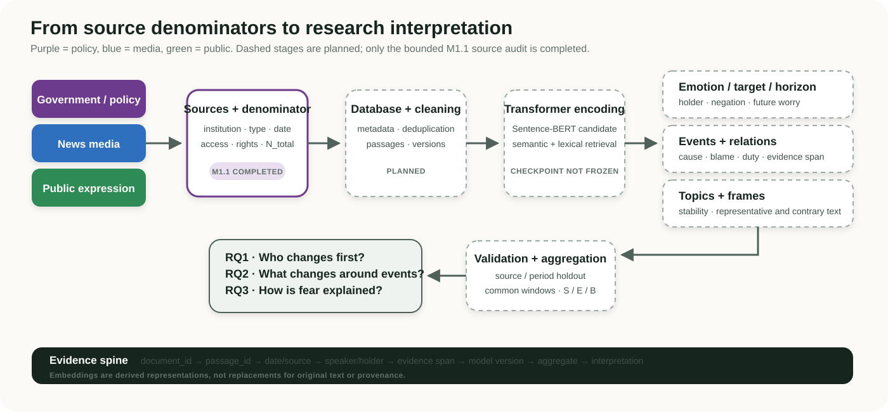
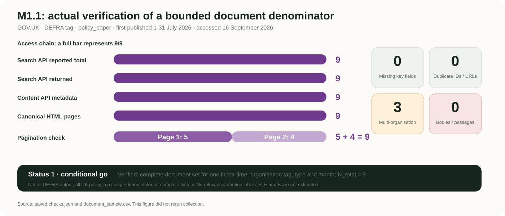

# Fear of Temperature
## Research direction and initial source-feasibility progress

**Dai Pan · Supervisor: Mashhuda Glencross · 16 September 2026**

> **Status key** — **Completed:** supported by saved local evidence. **Planned:** specified in the proposal but not yet run. **Decision needed:** requires supervisory, ethics or rights guidance.

## One-minute overview

The project still examines how fear and anxiety about rising temperatures are expressed across government policy, news media and public discourse. The methodological change is from exploratory keyword, dictionary and Ngram searches towards a traceable corpus, validated semantic retrieval and task-specific NLP, followed by temporal analysis. Lexical and TF-IDF methods remain baselines; Transformer methods must demonstrate added value on held-out material. The year 1988 is a collection anchor associated with the establishment of the IPCC, not a claimed origin of warming fear.

**Completed this week:** a bounded GOV.UK source-feasibility pilot. In the saved 16 September snapshot, there were nine GOV.UK `policy_paper` records tagged to DEFRA and first published in July 2026. The API reported nine and returned nine; pagination produced 5 + 4 records with the same set; 9/9 Content API records and public pages were accessible; missing and duplicate key fields were zero. This is a conditional go for one document-level denominator. It is not evidence about climate prevalence, emotion or temporal leadership, and no document bodies were retained for analysis.

---

## 1. The research question has not changed

The project studies how policy, media and public communication express fear and worry about rising temperatures, particularly concerns about future living conditions, families and future generations. It separates these expressions from immediate heat danger and asks:

- who changes first across the three communication roles;
- what changes around physical, scientific and policy events; and
- how causes, affected groups, blame and response duties are narrated.

The project is a computational study of a social question. The main scholarly output remains the thesis and its empirical interpretation; the corpus, database and code make the evidence reproducible.

### Why move beyond keywords and Ngrams?

| Earlier exploration | Current design | Reason for the transition |
|---|---|---|
| Dictionaries, keywords and Ngrams | Traceable corpus plus semantic retrieval | Similar concerns can use different words; the same word can occur in quotation, denial or unrelated contexts |
| Raw hit counts | Attention S, emotion E and derived joint share B with aligned denominators | A hit count is not an attention measure unless numerator and denominator come from the same eligible collection |
| Manually selected examples | Versioned queries, held-out validation and evidence spans | Reduces discretionary selection and preserves auditable counterexamples |
| General negative sentiment | Emotion, target, horizon, holder, cause, blame and duty as separate attributes | Similarity is not intensity; a risk statement does not automatically express fear |

**Planned, not completed:** the lexical dictionary and TF-IDF baselines will be compared with semantic retrieval using precision, recall, F1 and documented error types. A more complex model will only count as an improvement if the held-out evidence supports it.

### Why 1988?

The proposed core collection begins in 1988 because the establishment of the IPCC provides a clear institutional anchor. This is a scope choice, not a claim that fear began in 1988 or that an emotional break has already been observed. Earlier material can inform historical context. The final statistical window must be determined by defensible common coverage across policy, media and public sources; letters, early forums and contemporary platforms will not be treated as one seamless public-emotion series.

---

## 2. Planned end-to-end evidence chain

1. **Source and denominator audit:** define institution, document type, dates, access route, rights and the enumerable eligible total.
2. **Database and cleaning:** retain document and passage IDs, publication and collection dates, source role, publishing institution, quoted speaker, emotion holder, location evidence and duplicate clusters.
3. **Transformer encoding and retrieval:** encode passages and natural-language queries with a Sentence-BERT-type model; the exact checkpoint is not yet frozen.
4. **Three NLP components:** emotion/target/horizon; events, causes, blame and duties; topics and frames. GoEmotions is a dataset, not a project-ready climate-anxiety model. spaCy or Stanza is not a complete semantic-role or responsibility system.
5. **Validation and aggregation:** compare with lexical baselines, test source/period transfer, and only then aggregate within common monthly or quarterly windows.
6. **Research interpretation:** temporal estimates and narrative patterns must link back to original passages, contradictory evidence, quotation scope and uncertainty.

Planned measures: `S = relevant eligible units / all eligible units`; `E = future fear or worry within relevant units`; and `B = S x E`. B is derived from S and E, not independent corroborating evidence.

---

## 3. Three research questions and their boundaries

| Research question | Evidence and planned method | Interpretation boundary |
|---|---|---|
| **RQ1: Who changes first?** Compare leading, lagging, synchronous and feedback patterns across policy, media and public attention/emotion. | Common-window S/E; cross-correlation; conditional VAR tested against an own-history baseline with chronological holdout. | Temporal precedence and added prediction do not automatically establish causation or a communication mechanism. |
| **RQ2: What changes around events?** Estimate level and slope changes around independently dated heat, scientific or policy events. | Segmented regression / interrupted time series; window sensitivity; placebo dates; serial-dependence diagnostics. | Event-associated change may reflect anticipation, common shocks, source composition or channel changes. |
| **RQ3: How is fear explained?** Trace affected groups, causes, blame, duties and threatened futures across roles. | Evidence-linked relations, topics and frames; quotation and stance checks; representative and contradictory passages. | A grammatical subject is not necessarily culpable; semantic similarity does not imply agreement or emotional intensity. |

The questions address timing, events and meaning together. They are not three models operating independently. A non-significant result would not prove that policy dominates or that physical influences are absent.

---

## 4. Completed this week: M1.1 source feasibility

**Bounded set:** GOV.UK publication landing-page content items tagged to DEFRA, classified as `policy_paper`, with `first_published_at` between 1 and 31 July 2026 in the saved index snapshot.

| Completed check | Recorded result |
|---|---:|
| Search API reported / returned records | 9 / 9 |
| Pagination | 5 + 4; union matched the complete result set |
| Content API metadata / canonical HTML | 9/9 / 9/9, all HTTP 200 |
| Missing key fields | 0 |
| Duplicate content IDs / canonical URLs | 0 / 0 |
| Records linked to multiple organisations | 3 / 9 |
| Document bodies / paragraph examples retained | 0 / 0 |

**Decision:** status 1, conditional go. `N_total = 9` is complete only for this index time, organisation tag, document type and month. It is not all DEFRA output, all UK policy, a paragraph denominator or proof of complete 1988-2026 coverage.

### Three real index examples

1. [Air Pollution Awareness Coalition (APAC)](https://www.gov.uk/government/publications/air-pollution-awareness-coalition-apac) — first published 3 July 2026; updated 21 August; linked to DEFRA, DHSC and DfT. This shows why first publication and update dates must be separated.
2. [30by30 on land in England: Delivery plan](https://www.gov.uk/government/publications/30by30-on-land-in-england-delivery-plan) — first published 13 July 2026; classified as `policy_paper`; linked to DEFRA.
3. [British Sign Language 5-year plan: Department for Environment, Food and Rural Affairs - 1-year update, July 2026](https://www.gov.uk/government/publications/british-sign-language-5-year-plan-department-for-environment-food-and-rural-affairs-1-year-update-july-2026) — first published 15 July 2026. This non-climate record demonstrates that the denominator was not assembled from climate keyword hits.

---

## 5. Technical findings and current limits

### Completed and confirmed

- The Search API accepted `first_published_at` as a filter, but the response did not expose populated values for that field; `order=first_published_at` returned HTTP 422.
- The Content API supplied first-publication and update dates for local sorting and verification.
- Three of nine records were associated with multiple organisations. The pilot rule was “include if tagged to DEFRA and count each landing page once”, but no cross-institutional counting rule has been frozen.
- The saved snapshot records access time and SHA-256 evidence hashes.

### Not completed and not claimed

- Historical coverage, cross-period type consistency and repeated-snapshot stability have not been established.
- No document bodies or attachments were retained or analysed; supervision, ethics and item-level rights handling remain unresolved.
- There are no relevance or emotion labels, embeddings, topics, relations, S/E/B estimates, CCF, VAR or ITS results.
- Public visibility is not blanket permission to store or redistribute content. Most GOV.UK material is under OGL v3, but attachment, third-party and personal-data exceptions still require review.

Therefore, the pilot cannot support claims about climate prevalence, fear intensity, temporal trends, policy leadership, whole-government representativeness or complete historical coverage.

---

## 6. Plan for 21-27 September: 10-20 hours

| Work | Time | Concrete output and stop condition |
|---|---:|---|
| Preserve the saved snapshot; audit a recent, intermediate and earlier window | 3-5 h | Versioned coverage table; do not overwrite M1.1; downgrade denominator status if fields are unstable |
| Review the three multi-organisation records and date/unit rules | 2-3 h | Data dictionary and counting recommendation; no cross-institutional aggregation before supervisor decision |
| If authorised, test document-to-passage provenance on three public documents | 2-4 h | Small traceable passage sample; if conditions are not ready, restrict work to metadata or labelled synthetic checks |
| Measurement reading and design | 3-5 h | Two close readings, two targeted readings, draft semantic queries and annotation boundaries |
| Synthesis and demonstration | 0-3 h | Next meeting material; total remains within 20 h |

**Planned reading, not completed:** close reading of Sentence-BERT and Pihkala’s climate-emotion taxonomy; targeted reading of GoEmotions and Brulle et al.’s temporal design.

## 7. Decisions requested from the supervisor

1. Is 1988 an acceptable collection anchor if final statistical comparisons are restricted to defensible common windows?
2. For jointly associated policy records, should institutional attention count every linked organisation, only the lead/emphasised organisation, or use fractional weights?
3. What documented supervision, ethics advice and item-level rights records are required before a three-document passage-provenance pilot?
4. Should next week prioritise the historical coverage audit or freezing document/passage units and joint-publication counting rules?

## Closing

The project still asks how society expresses and explains fear of rising temperatures. The methodological change is towards a traceable corpus, validated NLP measurements and bounded temporal comparisons. This week established the feasibility of one narrowly defined policy-document denominator. The immediate priority is to make the data and measurement foundation defensible before running complex models.

## Evidence base

- Starting narrative: `docs/meetings/2026-09-16/meeting_report_en.md`.
- Current design: `proposal/thesis_proposal.md` and `proposal/thesis_proposal.pdf`.
- Clarifications and next-week plan: `docs/meetings/2026-09-16/research_narrative_zh.md`.
- Saved pilot evidence: `work_packages/M1_source_access/01_feasibility/README.md`, `document_sample.csv`, `source_access_register.csv`, `denominator_assessment.md` and `checks.json`.

This report did not rerun collection, make network requests or modify the M1.1 snapshot.
