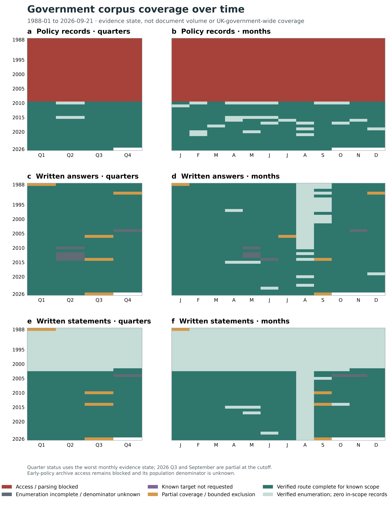

# Historical coverage recovery — final report

Snapshot: **2026-09-22T13:52:02Z**. This round reused the formal 06 database and performed only bounded historical recovery. No proposal, cleaning, vectors or model analysis were changed.

## Outcome

- Formal database moved from **239,586** to **248,035** documents: **8,449** genuine additions after successful commits (**8,405** written answers, **43** written statements and **1** policy record).
- Text segments increased by **44,838**. Final totals are **248,035 documents** and **3,668,275 unique text segments**.
- The mirror route froze **388 date partitions** and **816 XML files**; **816** files were acquired, **0** failed, and **0** remained unrequested after host stop.
- It parsed **10,853** in-scope records: **2,405** already existed, **8,448** were new stable identities, and **0** were duplicate mirror representations.
- One exact early policy was recovered: *Biodiversity: the UK action plan* (25 January 1994, Cm 2428, ISBN 0101242824). Its official 194-page PDF is retained and yielded **12,822** source-line segments across **188** text-bearing pages. The six no-text pages were visually verified as two blank pages and four image-only globe separators, so they do not hide policy prose. This one item does **not** make the 1988–2009 policy population complete.
- Reconciliation passed: **True**; duplicate `(source_id, external_id)` groups: **0**; excluded targets inserted by this recovery: **0**.

## Source and unit ledger

| Source | Metric | Value | Unit | Denominator / boundary |
|---|---|---|---|---|
| ParlParse/TWFY bounded mirror | Frozen target dates | 388 | date partition | 388 |
| ParlParse/TWFY bounded mirror | Dates with enumerated files | 373 | date partition | 388 |
| ParlParse/TWFY bounded mirror | Frozen files | 816 | XML file | 816 |
| ParlParse/TWFY bounded mirror | Original files acquired | 816 | XML file | 816 |
| ParlParse/TWFY bounded mirror | Files failed | 0 | XML file | 816 |
| ParlParse/TWFY bounded mirror | Files unrequested after host stop | 0 | XML file | 816 |
| ParlParse/TWFY bounded mirror | In-scope derived records parsed | 10,853 | derived record | n/a |
| ParlParse/TWFY bounded mirror | Already present | 2,405 | derived record | 10853 |
| ParlParse/TWFY bounded mirror | New stable identities | 8,448 | derived record | 10853 |
| ParlParse/TWFY bounded mirror | Written answers formally committed | 8,405 | ministerial written answer | 8448 |
| ParlParse/TWFY bounded mirror | Written statements formally committed | 43 | ministerial written statement | 8448 |
| ParlParse/TWFY bounded mirror | Duplicate mirror representations | 0 | derived record | 10853 |
| Official GOV.UK command paper | Exact policy targets acquired | 1 | policy publication | 1 |
| Official GOV.UK command paper | Extracted text lines | 12,822 | source line segment | 194 |
| Formal 06 database | New documents committed | 8,449 | document | 8449 |
| Formal 06 database | Recovery batch documents present | 8,449 | document | 8449 |
| Formal 06 database | Duplicate source/external-id groups | 0 | duplicate group | n/a |
| ParlParse/TWFY bounded mirror | Target date × genre units complete | 411 | date × genre | 431 |
| ParlParse/TWFY bounded mirror | Target date × genre units non-complete | 20 | date × genre | 431 |

Files, dates, pages and derived records are deliberately not added together. A no-file date has an unknown record denominator, not a zero document count.

## What changed in the gaps

- **2004-10-05 to 2004-12-31 Commons seam:** 43 previously identified sitting dates were checked against separate `wrans`/`wms` mirror holdings. Recovered records are reported by genre in `parlparse_record_manifest.csv`; months with a missing expected mirror file remain unknown in the fifth figure.
- **2010-05-01 to 2014-09-11 answers:** the original 20 failed date indexes, 225 failed pages and 212 unrequested pages remain distinct units. Their union produced a bounded date set; successful XML retrieval repairs known date partitions, while dates without a matching mirror file remain unresolved.
- **Named 2005–2010 anomalies:** Companies House was recovered under the exact BERR title/identity recorded in the identity ledger. Asda is excluded because its saved evidence cannot support reliable text/department attribution.
- **Early policy:** the verified Cm 2428 recovery improves actual 1994 text availability, but normal UKGWA access was blocked and predecessor-department catalogue coverage remains unknown. No broad completeness claim is made.

Mirror target dates with no file of either requested kind (**15 date partitions**): 2004-11-05, 2004-11-12, 2004-11-23, 2010-05-18, 2010-05-19, 2010-05-20, 2010-05-24, 2010-05-25, 2010-05-26, 2012-05-09, 2012-05-10, 2013-05-08, 2013-05-09, 2014-06-04, 2014-06-05. At the more precise date × genre level, **20 target units** remain non-complete (**16 answer units; 4 statement units**). These are not document counts.

## Explicit exclusions

| Target | Disposition | Reason |
|---|---|---|
| 90ab8a69-5a83-41d5-8761-35c4051f3a77 | excluded_ambiguous_text_or_attribution | Asda: saved navigator/detail evidence resolves to inconsistent department attribution |
| 06071282000011 | excluded_ambiguous_text_or_attribution | Asda: saved detail contains no separable question/response text |
| historic-item_4d25e8510d84ee46f2e3 | excluded_ambiguous_text_or_attribution | Self-regulating Bodies: mixed text cannot be reliably separated or attributed |
| 1009068000001 | excluded_non_includable_container | Cross-date Written Ministerial Statements container; identified children retained separately |

These **4 evidence rows** are retained but not counted as recovered. Two Asda evidence identifiers describe the same attribution problem; they are not converted into two missing documents. The unresolved statement container is not ingested as one statement; identified child statements remain separate.

## Coverage over time

`monthly_coverage_status.csv` keeps every month from 1988-01 through the 2026-09-21 cutoff. `quarterly_coverage_status.csv` applies a documented worst-evidence-state rule; its status counts are: Access / parsing blocked 88, Enumeration incomplete / denominator unknown 6, Known target not requested 0, Partial coverage / bounded exclusion 9, Verified route complete for known scope 302, Verified enumeration; zero in-scope records 60. These are coverage-state partitions, not document counts or coverage percentages.

- **Policy records:** 1988–2009 stays blocked/unknown at the population level despite the exact 1994 recovery. From 2010 onward, “complete” means complete only for the frozen current-DEFRA Search/API route.
- **Written answers:** recovered mirror records close only the target dates with a complete file/parse chain. Historic source boundaries, the Asda exclusion and the 2026 cutoff remain visible.
- **Written statements:** the 2004 seam is independently evaluated from `wms` holdings. The unresolved 2010-09 container remains excluded, and the 2014-09 source transition is marked partial.

## Refreshed distribution

The four distribution figures and CSVs were refreshed once after the final commit in `reports/final_distribution_coverage/`:

1. [Annual distribution](final_distribution_coverage/figures/01_annual_distribution.png)
2. [Year × month distribution](final_distribution_coverage/figures/02_year_month_heatmaps.png)
3. [Source × time coverage status](final_distribution_coverage/figures/03_collection_coverage_status.png)
4. [Department annual composition](final_distribution_coverage/figures/04_department_annual_composition.png)

The database now contains **1,055 policy-source records**, **244,229 ministerial written answers**, and **2,751 ministerial written statements**. These are heterogeneous series and are not summed as a homogeneous policy count.

## Remaining bounded gaps

1. Predecessor-department policy coverage for 1988–2009 still lacks an independent, reliable population denominator. The exact recovered item and catalogue evidence cannot substitute for complete enumeration.
2. **20** date × genre target units remain non-complete; their record count remains unknown. Download failures (**0 files**), unrequested-after-stop (**0 files**) and parse failures (**0 files**) are separate.
3. Ambiguous mixed records remain excluded. This preserves the denominator and provenance rather than manufacturing successful recovery.

The present corpus can proceed to source-aware cleaning only for the verified subsets. It still cannot support a claim of continuous, complete UK-government coverage from 1988 to 2026.
