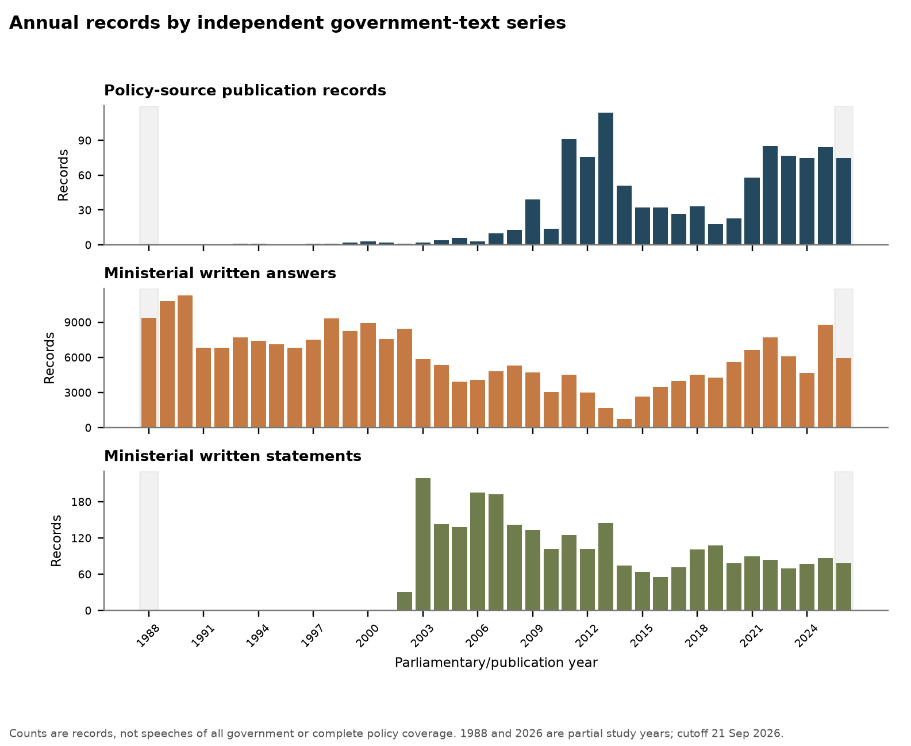
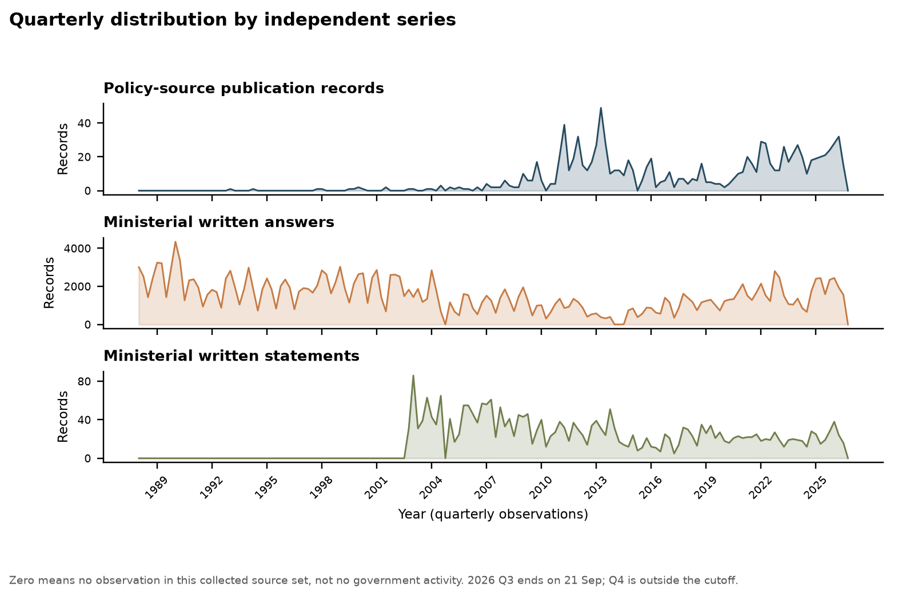

# Historical UK government acquisition: final acceptance

Cutoff: **2026-09-21**. Database: `work_packages/M1_source_access/06_government_content_acquisition/fear_temperature_government_content.duckdb`. This task adds bounded historical policies and an independent House of Commons ministerial written-answer/statement series. It does not modify the proposal, clean the corpus, vectorise text, or run model analysis.

## Outcome

- Policy-source publication records now total **1,054**; pre-2010 policy-source records increased from **55** to **89**. The original Search-API `policy_paper` / current Content-API type mismatch remains recorded rather than being recast.
- Ministerial written answers total **235,420**; written statements total **2,705**. They remain separate document types and denominators.
- Question/context segments retained separately: **259,179**. Government-response/statement segments: **373,626**. A question is never counted as a government response.
- Missing publication/parliamentary dates across the whole database: **0**; these are not reassigned from retrieval dates.
- The corrected Historic Hansard parser revised the frozen record manifest from **117,672** to **135,761** records. It excluded **16** task-created parser artifacts transactionally while retaining their raw evidence; no second full temporary smoke ingestion was run.

| Series | Before | After | Change |
|---|---|---|---|
| Policy-source records | 55 | 89 | 34 |
| Ministerial answers | 0 | 158178 | 158178 |
| Ministerial statements | 0 | 1193 | 1193 |

## Source-specific progress

| Source/tranche | Series | Enumerated target | Already in 06 | Net-new target | Original acquired | Parsed | Formally committed | Failed target records | Failed/retry objects | Unprocessed records | Unprocessed content objects |
|---|---|---|---|---|---|---|---|---|---|---|---|
| GOV.UK historical policy | policy_document | 35 | 1 | 34 | 34 | 34 | 34 | 0 | 4 | 0 | 0 |
| Historic Hansard bulk XML | answers + statements | 135761 | 0 | 135761 | 135761 | 135761 | 135761 | 0 | 1 | 0 | 0 |
| Hansard API 2005–2010 | answers + statements | 24833 | 0 | 24833 | 24748 | 24748 | 24748 | 85 | 92 | 0 | 0 |
| Commons archive/API 2010–2014 gap backfill | answers + statements | 11628 | 0 | 11628 | 11628 | 11628 | 11628 | 0 | 247 | 0 | 212 |
| Questions/Statements API 2014–2026 | answers + statements | 65988 | 0 | 65988 | 65988 | 65988 | 65988 | 0 | 0 | 0 | 0 |

Detailed status and denominator notes are in `source_progress.csv`. Object counts and record counts are deliberately not added together.
The year-level reconciliation is in `source_year_progress.csv`; policy object values there are within-year association counts and are not a cross-year unique-object total.

## Coverage interpretation

The policy backfill is complete only within the verified GOV.UK DTI, DECC, BERR and DETR organisation-tag query. DETR returned zero; no verified searchable UK DoE or MAFF GOV.UK organisation route was invented, and Northern Ireland DoE was not substituted. The official UK Government Web Archive A–Z index confirmed DTI, BERR, DECC and Defra site routes, but the first bounded DTI timeline request returned an AWS WAF human-verification page. The collector did not bypass that control or repeat the same blocked service for the other routes, so no archive-policy denominator or archive records are claimed.

Policy dates use official `first_published_at`. Downloaded GOV.UK pages and attachments are the versions available at this acquisition time; where `updated_at` is later, the current text is not assumed to reproduce the wording of the first-published version.

Historic Commons XML provides department-group enumeration for 1988–2004. Standalone written statements appear only where the archive supplies that category; the series is not backfilled before the category exists. For 2005–April 2010, official sitting calendars and daily section trees establish department-specific answer-section targets before detail acquisition. The current Hansard service explicitly does not expose post-April-2010 written-answer data, so the gap tranche uses the official dated publications archive: each sitting-day index freezes exact DEFRA/DECC links, the linked HTML is the downloaded parent evidence, and per-answer JSON is explicitly marked as derived rather than as a fictitious HTTP response. The record unit can contain multiple question or response segments. The modern Questions and Statements API begins in September 2014. Its 174 frozen list responses contain complete question/answer or statement fields for all 65,988 official IDs; per-record JSON is derived from those parents and no per-record HTTP 200 is invented. A stopped 1,000-record detail-path diagnostic is retained separately and does not define formal progress. The interval 2010-05-01 through 2014-09-11 remains a documented partial channel gap: 618/638 dated indexes were verified, 626/1063 frozen answer pages were acquired, 225 page requests failed and 212 pages were left unrequested after the dynamic throttle stop. Missing observations are not interpreted as zero speech.

BEIS, DTI and BERR are broad business departments. Their all-topic departmental records are preserved as enumerated; they must not be described as a climate-only sample without a later, separately governed selection stage.

## Distribution and use boundaries

The annual and quarterly CSVs contain zero rows for unobserved periods. Zero means “not observed in these collected official source partitions”, not “no government discourse”. 1988 is a partial study-start year and 2026 ends on 21 September.

Recommended provisional use: analyse policy documents, ministerial answers and ministerial statements as three independent series; restrict time comparisons to periods with demonstrable source continuity; retain explicit source-regime indicators; and do not claim a continuous 1988–2026 census or climate/fear selection. Do not impute unavailable source partitions or the invalid Historic Hansard volume 200.

## Residual issues

See `exceptions_and_gaps.csv`. The principal residuals are four downloaded historical-policy PDFs marked `needs_ocr`, the invalid official volume-200 download, failed statement/detail/archive-index or archive-page requests, unresolved UK DoE/MAFF policy indexes, and the explicitly incomplete 2010–2014 source partitions.

## Integrity acceptance

- Annual CSV totals match database series totals: **True**.
- Quarterly rows reconcile to annual rows: **True**.
- Duplicate/orphan checks: `{"source_external_duplicates": 0, "canonical_url_duplicates": 0, "orphan_segments": 0, "orphan_voice": 0, "historic_raw_records_not_marked_derived": 0, "historic_content_objects_not_zip_xml": 0, "archive_answer_raw_records_not_marked_derived": 0, "archive_parent_objects_not_html": 0, "archive_derived_record_count_mismatch": 0, "modern_raw_records_not_marked_derived": 0, "modern_parent_objects_not_json": 0, "modern_derived_record_count_mismatch": 0, "successful_parliament_fetches_without_http_200": 0}`.
- Frozen 04/05 artefacts unchanged: **True**.
- Overall acceptance passed: **True**.
