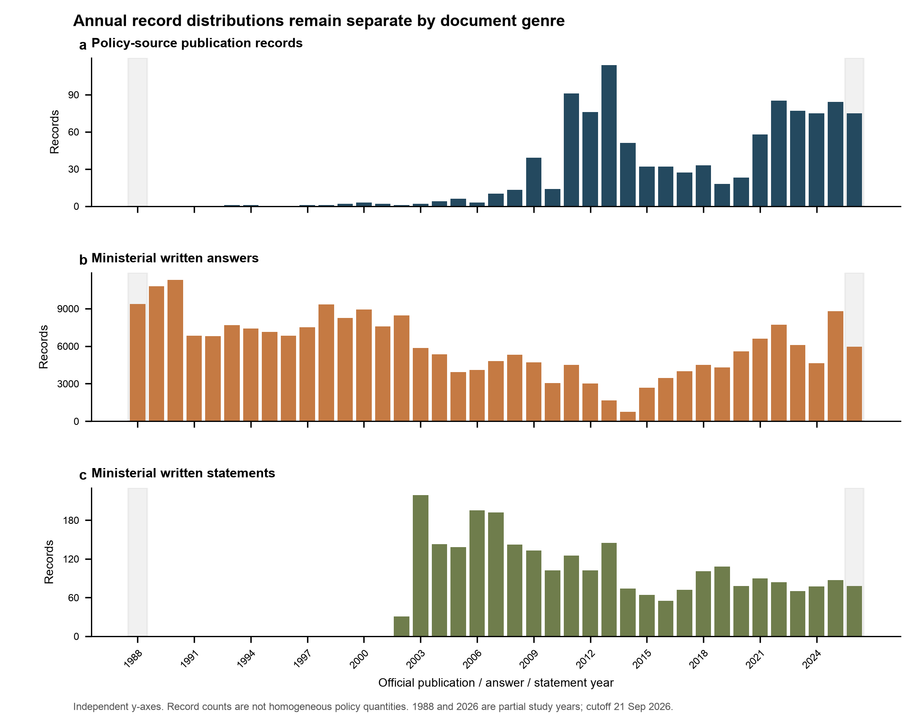
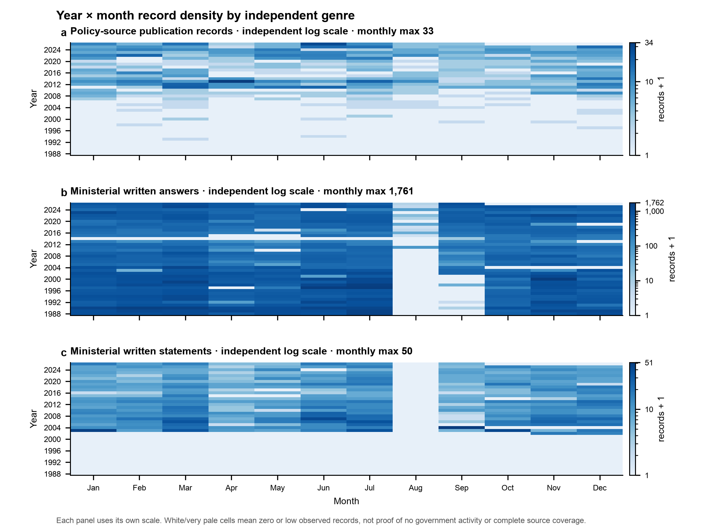
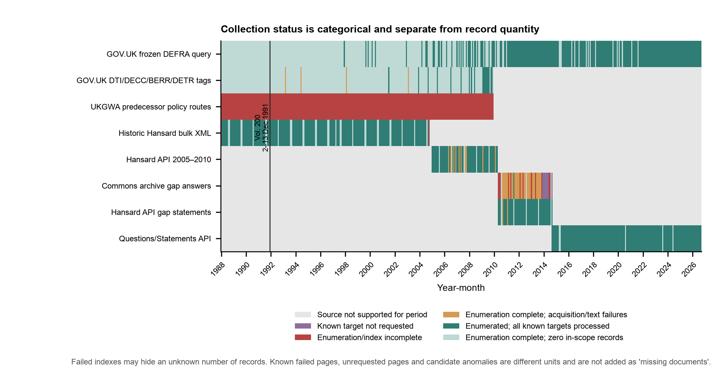
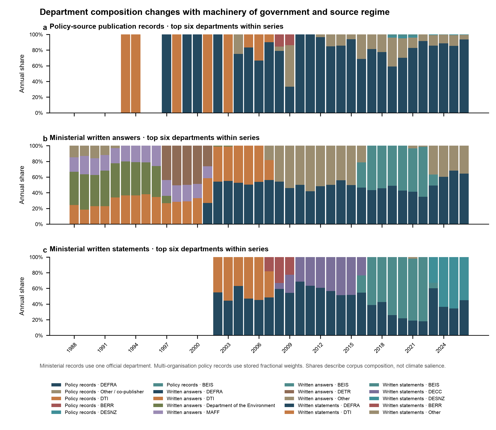

# 补采后的政府语料分布与覆盖评估

统计快照：**2026-09-22T01:25:54Z**；范围：**1988-01-01 至 2026-09-21**。数据库以只读模式打开；本目录是新建交付，不覆盖上一轮证据。未联网、未修改数据库、未清洗、未向量化、未修改 proposal。

## 1. 固定基线与口径

| Item | Expected baseline | Observed | Result |
|---|---|---|---|
| all_documents | 239,179 | 239,179 | match |
| policy_document | 1,054 | 1,054 | match |
| ministerial_written_answer | 235,420 | 235,420 | match |
| ministerial_written_statement | 2,705 | 2,705 | match |
| text_segments | 3,622,039 | 3,622,039 | match |

The expected 1,054 policy-source records are present. At schema level they are 1,053 `policy_paper` rows plus one retained `guidance` row from the original frozen Search/API type mismatch; this report classifies all GOV.UK source records as the policy-source series without rewriting the stored type.

三类文种始终分开：政策发布记录不是部长答复，部长声明也不并入答复。政策日期取可核验的发布日；部长答复取答复／坐席日；部长声明取声明日。库内三类记录均有日期，未用抓取时间填补。2026 年只统计到 9 月 21 日；Historic Hansard 的实际观察从 1988-01-11 开始。

| Document genre | Records | Unique text segments | Characters | Median chars/record | P90 chars/record | Months with records | Months without records |
|---|---|---|---|---|---|---|---|
| Policy-source publication records | 1,054 | 2,989,270 | 151,355,178 | 46,996 | 291,514 | 228 | 237 |
| Ministerial written answers | 235,420 | 627,397 | 184,124,378 | 513 | 1,405 | 409 | 56 |
| Ministerial written statements | 2,705 | 5,372 | 4,872,256 | 1,019 | 4,377 | 254 | 211 |

“字符数”和“片段数”是文本规模，不是独立观察数量。政策记录的 record-associated 片段合计比唯一片段多 **4**，来自共享内容对象的多记录关联；报告总量使用唯一片段数。

## 2. 年代、年度、季度和月度分布

- `decade_distribution.csv`、`annual_distribution.csv`、`quarterly_distribution.csv` 和 `year_month_distribution.csv` 分别保留三类文种；年度零值只表示当前数据库没有观察记录。
- 三类文种中有记录月份分别为：政策 **228**、答复 **409**、声明 **254**；这不是来源完成月数，完成状态另见第 3 节。
- 记录长度差异很大：政策字符中位数 **46,996**，答复 **513**，声明 **1,019**。P99 分别为 **1,668,544**、**3,918**、**9,852**。
- 少数超长记录的影响有限但不可忽略：各系列前 10 条记录占 record-associated 字符的比例分别为政策 **22.2%**、答复 **0.1%**、声明 **5.0%**。具体对象见 `top_20_longest_records.csv`。

## 3. 采集覆盖状态：与记录数量分开

状态图使用类别色，不把“索引失败”“未请求”“来源不支持”和“已确认零记录”画成同一种数值零。`coverage_status_by_source_month.csv` 同时保留每月记录数和不同异常单位。

重点缺口如下：

| Source | Interval | Issue | Count | Unit | Missing-record interpretation |
|---|---|---|---|---|---|
| Historic Hansard bulk XML | 1991-12-02..1991-12-13 | HTTP 200 invalid ZIP for volume 200 | 1 | volume | unknown |
| Hansard API 2005–2010 answers | 2005-01-01..2010-04-30 | frozen answer targets failed validation/acquisition | 85 | answer-section target | 85 known targets |
| Hansard API 2005–2010 statement candidates | 2005-01-01..2010-04-30 | candidate detail anomalies | 7 | candidate detail | eligibility unresolved; not added to answer failures |
| Commons archive gap answers | 2010-05-01..2014-09-11 | failed dated indexes | 20 | date index | unknown |
| Commons archive gap answers | 2010-05-01..2014-09-11 | failed known page targets | 225 | HTML page target | unknown records within pages |
| Commons archive gap answers | 2010-05-01..2014-09-11 | known page targets not requested after throttle stop | 212 | HTML page target | unknown records within pages |
| Hansard API gap statements | 2010-05-01..2014-09-11 | unresolved candidate details | 2 | candidate detail | eligibility unresolved |

- Historic Hansard volume 200 的真实日期范围是 **1991-12-02 至 1991-12-13**；HTTP 200 返回的是无效 ZIP，因此隐藏记录数未知。
- Historic Hansard 批量卷册在本库的真实边界为 **1988-01-11 至 2004-10-04**；1988 年 1 月和 2004 年 10 月在状态表中标为部分支持，不能按完整自然月解释。
- 2005–2010 的 **85 个答复目标失败**与 **7 个声明候选异常**不是同一单位，未相加成“92 篇缺失文档”。
- 2010-05-01 至 2014-09-11 仍是部分覆盖：20 个失败日期索引可能隐藏未知数量目标；225 个失败页面、212 个未请求页面和 2 个声明候选异常分别保留原单位。
- GOV.UK 历史标签查询只在 DTI/DECC/BERR/DETR 可见组织标签内完成；UK DoE/MAFF 等前身路径未取得可靠总体分母，图中为“枚举不完整”，不是零政策。

## 4. 分层覆盖率

| Source | Scope | Metric | Numerator / denominator | Unit | Rate |
|---|---|---|---|---|---|
| GOV.UK frozen DEFRA query | policy records | Index/enumeration completion | 39 / 39 | annual query partition | 100.00% |
| GOV.UK frozen DEFRA query | policy records | Frozen-target processing | 3,025 / 3,025 | content object | 100.00% |
| GOV.UK frozen DEFRA query | policy records | Original acquisition | 3,021 / 3,025 | content object | 99.87% |
| GOV.UK frozen DEFRA query | policy records | Text availability | 3,000 / 3,025 | content object | 99.17% |
| GOV.UK frozen DEFRA query | policy records | Formal ingestion completion | 1,020 / 1,020 | eligible publication record | 100.00% |
| GOV.UK historical organisation tags | policy records | Index/enumeration completion | 88 / 88 | organisation-year partition | 100.00% |
| GOV.UK historical organisation tags | policy records | Frozen-target processing | 84 / 84 | content object | 100.00% |
| GOV.UK historical organisation tags | policy records | Original acquisition | 84 / 84 | content object | 100.00% |
| GOV.UK historical organisation tags | policy records | Text availability | 80 / 84 | content object | 95.24% |
| GOV.UK historical organisation tags | policy records | Formal ingestion completion | 34 / 34 | eligible net-new publication record | 100.00% |
| Historic Hansard bulk XML | answers + statements | Index/enumeration completion | 319 / 320 | planned volume | 99.69% |
| Historic Hansard bulk XML | answers + statements | Frozen-target processing | 320 / 320 | planned volume | 100.00% |
| Historic Hansard bulk XML | answers + statements | Original acquisition | 319 / 320 | volume | 99.69% |
| Historic Hansard bulk XML | answers + statements | Text availability | 319 / 320 | volume | 99.69% |
| Historic Hansard bulk XML | answers + statements | Formal ingestion completion | 135,761 / 135,761 | eligible record from acquired volumes | 100.00% |
| Hansard API 2005–2010 answers | written answers | Index/enumeration completion | 64 / 64 | calendar-month partition | 100.00% |
| Hansard API 2005–2010 answers | written answers | Frozen-target processing | 23,990 / 23,990 | answer-section target | 100.00% |
| Hansard API 2005–2010 answers | written answers | Original acquisition | 23,905 / 23,990 | answer-section target | 99.65% |
| Hansard API 2005–2010 answers | written answers | Text availability | 23,905 / 23,990 | answer-section target | 99.65% |
| Hansard API 2005–2010 answers | written answers | Formal ingestion completion | 23,905 / 23,905 | eligible acquired record | 100.00% |
| Hansard API 2005–2010 statement candidates | written statements | Index/enumeration completion | 6 / 6 | annual candidate-search partition | 100.00% |
| Hansard API 2005–2010 statement candidates | written statements | Frozen-target processing | 7,013 / 7,013 | candidate detail | 100.00% |
| Hansard API 2005–2010 statement candidates | written statements | Original acquisition | 7,006 / 7,013 | candidate detail | 99.90% |
| Hansard API 2005–2010 statement candidates | written statements | Text availability | 7,006 / 7,013 | candidate detail | 99.90% |
| Hansard API 2005–2010 statement candidates | written statements | Formal ingestion completion | 843 / 843 | eligible acquired statement record | 100.00% |
| Commons publications archive gap answers | written answers | Index/enumeration completion | 618 / 638 | dated sitting-day index | 96.87% |
| Commons publications archive gap answers | written answers | Frozen-target processing | 851 / 1,063 | known HTML page target | 80.06% |
| Commons publications archive gap answers | written answers | Original acquisition | 626 / 1,063 | known HTML page target | 58.89% |
| Commons publications archive gap answers | written answers | Text availability | 626 / 1,063 | known HTML page target | 58.89% |
| Commons publications archive gap answers | written answers | Formal ingestion completion | 11,135 / 11,135 | eligible record parsed from acquired pages | 100.00% |
| Hansard API gap statement candidates | written statements | Index/enumeration completion | 5 / 5 | annual candidate-search partition | 100.00% |
| Hansard API gap statement candidates | written statements | Frozen-target processing | 5,676 / 5,676 | candidate detail | 100.00% |
| Hansard API gap statement candidates | written statements | Original acquisition | 5,674 / 5,676 | candidate detail | 99.96% |
| Hansard API gap statement candidates | written statements | Text availability | 5,674 / 5,676 | candidate detail | 99.96% |
| Hansard API gap statement candidates | written statements | Formal ingestion completion | 493 / 493 | eligible acquired statement record | 100.00% |
| Questions/Statements API 2014–2026 | answers + statements | Index/enumeration completion | 62 / 62 | department-year-genre partition | 100.00% |
| Questions/Statements API 2014–2026 | answers + statements | Frozen-target processing | 65,988 / 65,988 | derived record target | 100.00% |
| Questions/Statements API 2014–2026 | answers + statements | Original acquisition | 174 / 174 | parent API response | 100.00% |
| Questions/Statements API 2014–2026 | answers + statements | Text availability | 65,988 / 65,988 | derived record target | 100.00% |
| Questions/Statements API 2014–2026 | answers + statements | Formal ingestion completion | 65,988 / 65,988 | eligible derived record | 100.00% |

每一率都保留自己的分母。特别是现代接口的 **174 个父 API 响应**与其中派生的 **65,988 条记录**从未混用为同一分母。枚举不完整的来源，成功子集的下载、文本和入库比例只描述已知目标，不能外推为历史全集覆盖率。

## 5. 部门与文种构成变化

- 新增长主要来自部长答复系列和新增官方来源，而非政策发布数量同比例增长。Historic Hansard、2005–2010 Hansard API／archive、2010–2014 publications archive 与 2014 后 Questions/Statements API 的记录单位和父证据结构不同。
- DTI written-answer share peaks in 2005: 1,940/3,919 (49.5%). BERR written-answer share peaks in 2008: 2,110/5,321 (39.7%). BEIS written-answer share peaks in 2022: 4,917/7,698 (63.9%). DTI、BERR、BEIS 均为全主题部门材料，不能把这些年度峰值解释为气候关注度或恐惧表达变化。
- Policy records: DEFRA carries 75.5% of weighted characters. Written answers: DEFRA carries 26.8% of weighted characters. Written statements: DEFRA carries 53.4% of weighted characters. 部门主导反映批准范围、部门存续与来源结构，也可能反映长文本；不构成主题结论。
- 政策、答复、声明的相对构成随来源交界明显改变。2004/2005、2010-05、2014-09 是方法边界：分别从批量卷册到逐条详情、再到 publications archive 派生记录、最后到父列表响应派生记录。跨边界比较必须带来源制度变量，不能直接把数量变化解释为话语变化。

## 6. 后续可用时间范围建议

### 政策发布记录

- **可继续进入清洗：** 已有文本的 1,054 条记录可按当前来源标签进入格式与正文识别；四个 `needs_ocr` 附件和原 06 的对象级提取异常需单独标志。
- **部分覆盖：** 1988–2009 的历史政策只完成 GOV.UK 可见组织标签，不代表前身部门档案全集；1993 前零记录尤其不能作历史不存在解释。
- **候选比较区间：** 先在同一 GOV.UK 来源制度且月份状态可核验的区间内做描述性月／季度比较；是否与部长、新闻、公众层共窗，仍待其他来源确认。
- **下一轮最值补缺口：** UK DoE/MAFF/DETR 官方档案入口及四个 OCR 对象。前者改善早期政策总体分母，后者改善已知对象的文本可得性；两者作用不同。

### 部长书面答复

- **可继续进入清洗：** 1988–2004 的 319 个有效卷册内记录、2005–2010 的 23,905 个成功答复目标、2014-09-12 后现代接口记录，可进入来源感知清洗。
- **部分覆盖：** 1991-12-02..13（volume 200）、2005–2010 的 85 个失败答复目标，以及整个 2010-05-01..2014-09-11 gap tranche。后者存在索引级未知，不应声称连续覆盖。
- **候选比较区间：** 适合优先在各自稳定来源制度内做月／季度候选比较，例如 Historic Hansard 的有效卷册区间、2005-01 至 2010-04 的已知成功分区、2014-09-12 后现代接口；跨制度拼接需敏感性检查。
- **下一轮最值补缺口：** 先解决 20 个失败日期索引和 212 个未请求页面，因为它们决定 2010–2014 的未知分母；随后处理 225 个失败页面。不能把这些不同层级直接相加为缺失记录数。

### 部长书面声明

- **可继续进入清洗：** 已入库且身份核验的 2,705 条声明可进入独立清洗，始终与答复分开。
- **部分覆盖：** Historic Hansard 仅保留档案明确提供的独立声明类别；2005–2010 有 7 个候选异常，2010–2014 有 2 个候选异常。缺少独立类别时不能把答复内讲话重分类成声明。
- **候选比较区间：** 2014-09-12 后现代 statements 接口最一致；更早时期只适合在各自来源定义内比较。
- **下一轮最值补缺口：** 9 个候选详情异常可改善已知候选判定，但不会自动证明早期声明系列完整。

共同结论：本轮总量足以支持后续来源感知清洗，但**不足以仅凭总量宣布 1988–2026 连续时间序列可比**。政策、部长话语与新闻／公众层的共同窗口仍需等待其他来源的分布与覆盖确认，由 Dai 决定是否补缺口。

## 7. 数值与视觉核对

- 年度、季度、月度、年代总数均与同一只读快照对齐：**True**。
- 数据库大小与修改时间在读取前后不变：**True**；未执行全库哈希。
- 每项覆盖率分母为正、单位明确：**True**。
- 图表只使用对应 CSV 数据；源代码、对齐 JSON、PDF 字号与碰撞检查记录在 `qa/`。
