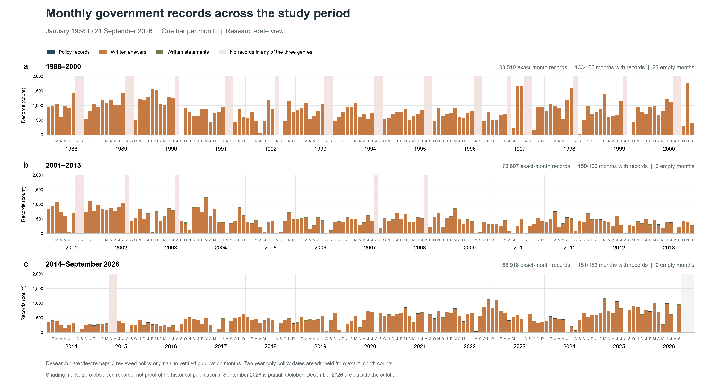
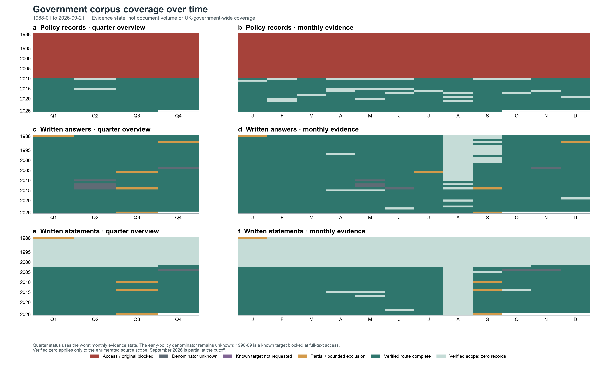

# Historical coverage recovery: zero-month and early-policy audit

Generated: `2026-09-23T01:21:44Z`. Formal database mode: **read-only**.

## Current-tranche outcome

- New formal documents: **0**; new text segments: **0**; formal database writes: **0**.
- Existing originals date-reviewed: **5** — **3** can be reassigned to a verified publication month, while **2** remain year-only and are withheld from exact-month analysis.
- Previously blank months made non-zero: **0 of 31**. The date corrections land in months that already contained records.
- Within the 31 completely blank months, policy dispositions are **29** denominator-unknown and **2** confirmed zero only within the frozen current-DEFRA route.
- Parliamentary dispositions: **62 of 62 genre-month rows** remain confirmed zero within the already enumerated Commons scope. Recess/dissolution is calendar context, not the enumeration denominator.
- The known missing September 1990 policy target is *This Common Inheritance* (Cm 1200). That month is **not** one of the 31 completely blank months because seven written answers are present. Its metadata and date were verified, but the checked scan is access-restricted; it was not counted as recovered.

## Formal 06 database snapshot

| Metric | Count |
|---|---|
| Documents | 248,035 |
| Policy records | 1,055 |
| Ministerial written answers | 244,229 |
| Ministerial written statements | 2,751 |
| Text segments | 3,668,275 |

This matches the post-repair baseline (248,035 documents and 3,668,275 text segments). No re-ingestion, full smoke test or full-database hash was run.

## Original-publication date decisions

| Title | Stored date | Research date | Precision | Exact-month view |
|---|---|---|---|---|
| Securing the future: delivering UK sustainable development strategy | 2011-03-25 | 2005-03 | month | yes |
| Working with the grain of nature: a biodiversity strategy for England | 2011-03-29 | 2002-10 | month | yes |
| Conserving biodiversity: the UK approach | 2011-05-24 | 2007-10 | month | yes |
| England biodiversity strategy: Climate change adaptation principles | 2011-05-24 | 2008 | year | no |
| United Kingdom overseas territories biodiversity strategy | 2011-05-26 | 2009 | year | no |

The stored GOV.UK dates and stable IDs are preserved as source metadata. The research-date CSV is a versioned analytical mapping, not an overwrite. Filenames and PDF creation timestamps were not used to manufacture exact dates.

## Bounded early-policy target register

| Command | Title | Verified date | Status |
|---|---|---|---|
| Cm 1200 | This Common Inheritance: Britain's Environmental Strategy | 1990-09 | known_target_original_unavailable |
| Cm 2426 | Sustainable Development: The UK Strategy | 1994-01-25 | catalogued_original_not_acquired |
| Cm 2427 | Climate Change: The UK Programme | 1994-01-25 | catalogued_original_not_acquired |
| Cm 4345 | A Better Quality of Life: A Strategy for Sustainable Development for the United Kingdom | 1999-05 | catalogued_original_not_acquired |
| Cm 4913 | Climate Change: The UK Programme | 2000-11-17 | official_archive_access_blocked |
| Cm 6467 | Securing the Future: Delivering UK Sustainable Development Strategy | 2005-03 | existing_original_date_mapped |

No evidence-sufficient new full original was acquired. Catalogue records, bibliographic previews, excerpts, parliamentary citations and the UNFCCC summary are not substituted for full policy originals. The UK Government Web Archive route for Cm 4913 returned an access-control/WAF page; retries stopped without bypass.

## The 31 blank months

All 31 remain blank in the database and in the exact-month research view. That observation has three different meanings:

1. Written answers and statements: scoped confirmed zero after the prior applicable-route enumeration. Most months coincide with Commons recess or dissolution, but August 1991 included a recall and is therefore not explained solely by recess.
2. Policy records, 1988–2009: the predecessor-department catalogue denominator is still unknown. Separately, September 1990 is stronger evidence of a policy-series gap because a specific policy target is known but unavailable; seven written answers mean it is outside this 31-month all-series-zero set.
3. Policy records, April–May 2015: confirmed zero only within the frozen GOV.UK current-DEFRA policy query; this is not a claim about all departments.

The authoritative row-level decision is in `month_recovery_ledger.csv`; unknown candidates are not converted to a numeric missing-document total.

## Refreshed views

The exact-month research view contains **248,033** of the **248,035** database records. Two policy originals with year-only dates are deliberately withheld, and the companion CSV preserves both stored and research counts.

The second figure encodes evidence state, not document volume or a UK-government-wide coverage percentage. Quarterly cells use the worst monthly evidence state; monthly data remain in the paired CSV.

## Next bounded actions

- Pursue institutional/official-library copies by command number and ISBN for Cm 1200, 2426, 2427, 4345 and 4913. This improves early-policy full-text coverage without expanding modern data.
- Keep year-only original dates out of monthly/quarterly comparisons until an independent month is verified.
- Do not retry the WAF/captcha route automatically. Resume only through an ordinary lawful archive or library access path.
- Retain the policy series as partial/unknown for 1988–2009; do not interpret its zeros as absence of policy activity.

## Delivered evidence

- `month_recovery_ledger.csv`: 31 months × 3 genres, before/after counts and scoped decisions.
- `research_publication_date_mapping_v1.csv`: five reviewed originals with page-level evidence and hashes.
- `early_policy_target_register.csv`: six bounded policy targets and exact next steps.
- `source_evidence_log.csv`: source route, real response evidence where captured, and stop decisions.
- `actual_acquisition_manifest.csv`: current-tranche outcome; no new full original.
- `incremental_reconciliation.csv`: unchanged formal-database counts.
- `reports/monthly_reference_availability_corrected.csv`: stored-date and research-date counts kept side by side.
- `reports/coverage_status_by_series_month_updated.csv`: refreshed monthly evidence state.
