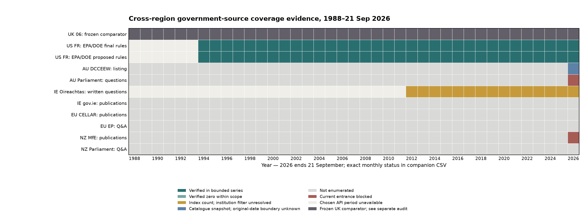

# Cross-region government-source coverage reconnaissance

Cutoff: **21 September 2026**. This is a metadata-enumeration tranche, not a merged international corpus and not a claim of historical completeness. The UK 06 database was read only and remains a frozen comparator: 248,035 documents (1,054 `policy_paper` + 1 `guidance`, 244,229 ministerial written answers, 2,751 written statements) and 3,668,275 text segments. Those genres are not interchangeable.

## Verified bounded enumerations

| Source and exact scope | Planned partitions | Reconciled evidence | Unit and limit |
|---|---:|---:|---|
| US Federal Register API: EPA/DOE agency hierarchy × final/proposed rules, 1994–cutoff | 132 year×agency×genre | 132/132; 33,560 stratum hits, 33,544 unique canonical document URLs | Rule/proposed-rule records, **not** all US policy or climate publications. 16 cross-agency duplicate hits. Two document-number collisions require URL+date identity. |
| Australian DCCEEW current all-publications listing | 83 pages | 83/83; 823 cards, 821 unique landing URLs; 821 cards have CMS-created date by cutoff | Landing pages, **not** unique full-text policy files. Earliest CMS timestamp 2003-09-08; original dates and attachment boundaries unknown. |
| Irish Oireachtas `/questions`: `qtype=written`, all departments, Jul 2012–cutoff | 171 months | 171/171 successful monthly index queries; 684,809 indexed questions; 19 months with verified index zero | Question-index counts only. Annual API counts cap at 10,000, so monthly sub-10,000 counts were used. No API department filter; no full record/answer enumeration. |

All response bodies and per-request URL, final URL, status, timestamp, MIME type and SHA-256 are in `evidence/`; filters and counts are in the CSVs. The US selected series begins in the API in 1994; 1988–1993 are **not supported by that route**, not years with no US government material. The Australian 83-page snapshot was observed on 23 September 2026 and includes two cards after the research cutoff; its CMS timestamps must not be presented as original publication dates. Irish zero months are zeros for the **all-department written-question index**, not for government answers or the target environmental departments.

## Sources not yet denominator-ready

EU: [CELLAR](https://op.europa.eu/en/web/cellar/cellar-data/metadata/knowledge-graph) provides an official Work–Expression–Manifestation route, but institutional and genre filters have not been frozen or enumerated. The [European Parliament API](https://data.europarl.europa.eu/en/developer-corner/opendata-api) yielded one original question Work in RDF/XML; a question is not a Commission/Council answer, and the sample cannot be turned into a count. Ireland's [gov.ie department publications](https://www.gov.ie/en/organisation/department-of-the-environment-climate-and-communications/) entrance is verified but not enumerated. New Zealand's [MfE publications](https://environment.govt.nz/publications/) returned an HTTP-200 challenge page, not publication data; Parliament's written-question entrance is verified but not enumerated. The current Australian House questions entrance returned HTTP 403. No access control was bypassed and none of these were assigned a zero count.

## Record boundaries and comparability

The [source register](source_register.csv) records exact institution filter fields/values, genre, stable or candidate ID, date precision, record boundary, dedup scheme, provenance tier, coverage completeness, record-boundary confidence and rights/access separately—there is no opaque authenticity score. The [spot checks](source_to_record_spot_checks.csv) show an ordinary US rule, a Federal Register document-number collision (1995 `95-24211` has different dated canonical pages), a single rule hit in both EPA and DOE strata, a duplicated Australian landing URL, an Irish MP question with a separate answer field, and an EP question Work. US canonical URL is the union key; the `document_number` alone is unsafe. AU page/file boundaries remain `boundary_unknown`. For EU, EN-language manifestations must not inflate Work counts. Question, answer and attachment are separate roles, even when an API wraps them together.

The [identity status ledger](identity_relationship_status.csv) records **18 exact metadata-hit duplicate groups**, **0 verified mirrors**, **2 near-duplicate relationship candidates**, and **0 observed same-event/distinct-voice pairs** in this bounded metadata tranche. “Zero observed” for the latter two verified classes is not evidence of absence in governments' output. The [record-level identity examples](record_identity_examples.csv) preserve jurisdiction, institution, genre, ID, edition, original/portal dates, language, URL, content-hash availability and parent/original relationship. We collected no publication-file hashes; response-body SHA-256 values prove retrieval integrity, not document identity. A shared Paris Agreement event, same month, similar title or topic would **not** license collapsing country-specific policy voices. Unlinked cross-site resemblance remains a candidate, never an automatic deletion.

The source composition is **not yet balanced** for cross-region time-series comparison. US rulemaking is a narrower administrative genre, Australian cards are a current-department catalogue snapshot, Ireland's counts cover parliamentary questions with neither department nor chamber query restriction rather than government answers, and EU/NZ are not enumerated. Department succession, migration dates and historical completeness need series-specific checks before a common window is claimed. Germany/France and other non-English candidates remain language/comparability candidates, not members of this English-core denominator. Official discourse is evidence of an institution's position or wording, not a claim that its factual assertions are objectively true.

## Decision for the next tranche

Use the verified US rule series as a bounded **source-specific** coverage candidate from 1994 to the cutoff. Do not combine its counts with the UK policy or ministerial-answer series. For AU, resolve original publication date, landing-page/file relationship and predecessor-department coverage before counting policy documents by year. For Ireland, retrieve bounded question/answer metadata and verify responder department and answer date; pre-July-2012 written replies require a separate archival route. Freeze EU CELLAR institutional/genre filters and EP answer-issuer filters before enumeration; resolve NZ/Australian parliamentary official access via ordinary alternative routes. None of these pending work items justifies an all-region coverage percentage now.

Companion files: [monthly source status](monthly_source_coverage_status.csv), [US partition identity audit](us_fr_partition_identity_audit.csv), [deduplicated US records](us_fr_unique_documents.csv), [overlap/collision ledger](overlap_and_identity_issues.csv), and raw source CSVs in the parent directory. A count is supplied only with its source, filter, unit and denominator.
