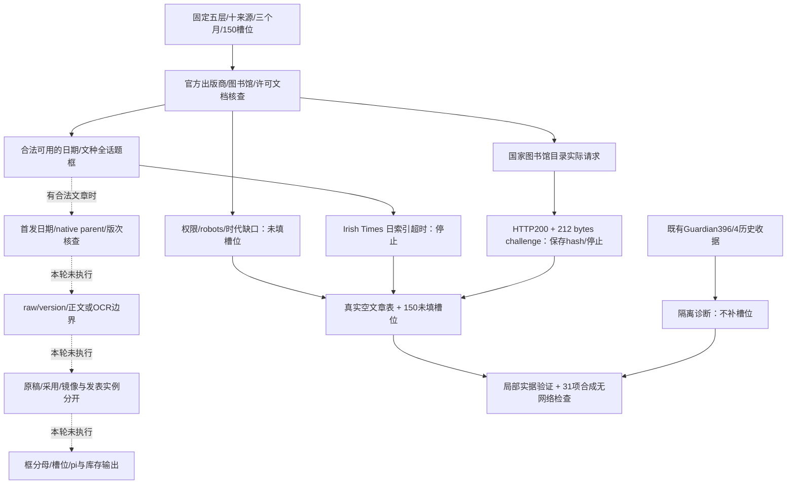

# 媒体/报纸预采集交接（2026-10-05）

本轮完成的是**有真实访问结果的有界预采集设计与验证包**，不是完成150篇正文采集。五个互斥层各冻结30个槽位，10个编辑来源×3个月×5篇，共150槽位；**新增文章parent=0、正文版本=0，150槽位均未填**。真实本地HTTP尝试1次，保存212 bytes，partial=0；响应虽为200，内容只有访问验证脚本，无可读目录/文章。原始响应保留，终止状态另列，未执行脚本或重试。

判定状态为 `bounded_precollection_complete_with_access_gaps`。当前数据不足以验证新闻文章正文、纸报OCR或转载关系的真实提取效果，不能声称全链路实采成功。合成夹具只验证结构约束、解析和停止行为；可访问正文并非本任务完成设计的前提。

## 范围、来源与冻结依据

发表区间始终为1988-01-01–2026-09-21，2026-09部分覆盖。主稿 [§1.3:70](/Users/jarlgiovanni/Desktop/fear_of_temperature/proposal/thesis_proposal.md:70)明确US、European settings、AU、NZ；[§3.3:182](/Users/jarlgiovanni/Desktop/fear_of_temperature/proposal/thesis_proposal.md:182)列Guardian初始新闻路线。当前指令把UK另设配额层，UK不再计入Europe。round2 [§1.2:59](/Users/jarlgiovanni/Desktop/fear_of_temperature/docs/proposal/round2/proposal_working_draft_en.md:59)及100行重复四个核心地域组，没有发现需额外同额纳入的明确核心国家。

[§3.3:194](/Users/jarlgiovanni/Desktop/fear_of_temperature/proposal/thesis_proposal.md:194)把扩展档案称为 acquisition extension strata，这与1.3的地理核心属于不同口径；未改写Proposal。Chinese-language/East Asia/AOSIS仍为候选扩展，不开启新采集。[§3.4:214–219](/Users/jarlgiovanni/Desktop/fear_of_temperature/proposal/thesis_proposal.md:214)及[226行](/Users/jarlgiovanni/Desktop/fear_of_temperature/proposal/thesis_proposal.md:226)支持角色、引述、日期/版本、固定来源混合及source-era区分。Ireland此前研究材料针对政府/Oireachtas，**不能作为Irish Times媒体可用性验证**。

来源在正文检索前冻结，原文件SHA256为 `11abb4f9421424ba9330b1ae133e8ee467722f639131c54de139a6d6b04bf8bb`。月份为1995-07、2015-12、2025-07；各来源每月5槽位。来源选择按编辑身份、出版市场及载体组合进行，不按气候/恐惧词、长度或可抓量选取。Europe使用IE/DE两个市场锚点，不声称覆盖全部Europe。

| 配额层 | 报纸 / 独立新闻来源 | 冻结槽位 | 新填槽位 | 保留缺口 |
|---|---|---:|---:|---:|
| EU/Europe，排除UK | Irish Times（IE） / DW（DE） | 30 | 0 | 30 |
| UK | Guardian / BBC News | 30 | 0 | 30 |
| AU | Sydney Morning Herald / ABC News Australia | 30 | 0 | 30 |
| US | New York Times / NPR | 30 | 0 | 30 |
| NZ | NZ Herald / RNZ | 30 | 0 | 30 |

固定比较权重为地区0.2、层内来源0.5；库存保留权重1。它们是设计权重，不是全国总体权重。未填配额不转给易访问来源，缺失时不静默重归一。明确完整框内的概率设计才能赋pi；本轮为非概率路线先导，全部pi=NULL，所有月分母NULL，确证publication zero为0项。

## 实际访问与缺口

逐月、逐来源、逐时代状态见 [AVAILABILITY_MATRIX.csv](/Users/jarlgiovanni/Desktop/fear_of_temperature/work_packages/M1_source_access/19_gov_closeout_and_media_transition_20261005/02_media_precollection/AVAILABILITY_MATRIX.csv)，计数证据和条件见 [OFFICIAL_EVIDENCE.csv](/Users/jarlgiovanni/Desktop/fear_of_temperature/work_packages/M1_source_access/19_gov_closeout_and_media_transition_20261005/02_media_precollection/OFFICIAL_EVIDENCE.csv)。不将下面的未知、未尝试或权限限制写成当月无发表。

| 来源 | 本轮实际路线/结果 | 对三个时期的限制 |
|---|---|---|
| Irish Times | 官方数字年/月索引可见；2025-07为31个日期导航链接，第一天文章索引工具超时后停止 | 显示年范围从1996起；1995纸报档案需登录。2015年目录可见，未取得12月文章框。31天≠31篇。 |
| DW | 官方当前条款未读成，域名robots停止；旧专项imprint有德国机构身份线索 | 1994上线信息不证明1995英语新闻月框完整；当前总新闻权限与三个时期正文均待核。 |
| Guardian | 新采集受当前条款gate；仅保留既有396/4的原范围收据 | 1995超出1999+ API路线；2015历史诊断不是全话题框；2025未请求。 |
| BBC | 官方条款路线robots拒绝；不换客户端 | News Online始于1997，1995广播属另一框；2015/2025月文章库存未知。 |
| SMH | 官方robots/条款探测未取得可核正文；国家图书馆有1955–1995在馆档案产品记录 | 在馆产品不表示当前可远程访问，也不证明1995-07逐文章覆盖；历史所有者不回填为Nine。 |
| ABC | 官方旧archive入口已停更；有界日期路径探测失败后停止 | 旧入口与停更RSS均非完整月框；许可syndication产品≠本会话授权。 |
| NYT | 官方GitHub月度Archive API说明可读；API需key，未建立当前权限，未读取凭据/调用API | 1851+目录设计不证明本会话取得三个时期的metadata或正文；大月响应可能超过2 MiB对象上限。 |
| NPR | 官方域名robots停止；CDS premium产品需partner agreement | 会员转载的NPR条款证据单列为archival reproduction；不把会员稿换成NPR采集来源。 |
| NZ Herald | 出版商权限gate；国家图书馆目录可作身份元数据路线 | 本地目录请求HTTP200/212 bytes实为challenge；web此前可见目录不等于本地取得全文、issue或月库存。 |
| RNZ | 官方legal条件形成采集gate | programme schedule许可不推导为news text许可；三个时期未枚举。 |

[Guardian access介绍](https://open-platform.theguardian.com/access/)的dissertation developer选项，不能取代逐项条款和具体许可核实；其当前gate依据单列GU1。旧API测试401未重试，也未读取环境token。BBC/DW/NPR等工具提供的robots拒绝不伪称原站HTTP403。工具内部error/timeout也没有补造origin status。

已核实许可**产品路线**： [ProQuest TDM Studio](https://about.proquest.com/en/products-services/TDM-Studio)描述机构已许可内容的rights-cleared研究环境；[Historical Newspapers Global](https://about.proquest.com/en/products-services/pq-hist-news/)列Guardian/NYT。它们不能证明UQ/本用户当前title-year holdings、TDM Studio权限、本地raw导出或公开分享权。UQ官方guide仅有搜索结果线索，页请求失败；未登录、申请账号/订阅或联系第三方。4种许可路线与具体未核项见 [LICENSE_ROUTE_OPTIONS.csv](/Users/jarlgiovanni/Desktop/fear_of_temperature/work_packages/M1_source_access/19_gov_closeout_and_media_transition_20261005/02_media_precollection/LICENSE_ROUTE_OPTIONS.csv)。

## 原证据、schema与链路

历史Guardian环境档案396条metadata、31日档案页，以及4个body诊断的URL/日期/文件hash保留在 [LEGACY_GUARDIAN_RECEIPTS.json](/Users/jarlgiovanni/Desktop/fear_of_temperature/work_packages/M1_source_access/19_gov_closeout_and_media_transition_20261005/02_media_precollection/LEGACY_GUARDIAN_RECEIPTS.json)。其中3条body检查在round2 CSV，另一条在较早media pilot review；旧检查经过environment/标题选择，不能补填这150个全话题槽位。旧CSV中的诊断/摘录未复制或重标；本轮没有其完整body。checksum不证明当前正文等于历史正文。

[schema.sql](/Users/jarlgiovanni/Desktop/fear_of_temperature/work_packages/M1_source_access/19_gov_closeout_and_media_transition_20261005/02_media_precollection/schema.sql)包含18表、196字段；[字段字典](/Users/jarlgiovanni/Desktop/fear_of_temperature/work_packages/M1_source_access/19_gov_closeout_and_media_transition_20261005/02_media_precollection/FIELD_DICTIONARY.md)逐字段定义。核心分开：publisher/outlet/edition/source-era；独立发表parent/纸报issue/page/OCR边界；raw/内容版本/首发/更新/抓取/版本时刻；署名/引述者/来信作者；wire原始story/各媒体采用/镜像/索引重复；身份、日期、内容三种核查状态及direct-original/archival/indirect/mixed/unresolved来源类别。不存在一个不透明总分，也不把来源核实等同文中全部事实为真。

数据库 [media_pilot.sqlite](/Users/jarlgiovanni/Desktop/fear_of_temperature/work_packages/M1_source_access/19_gov_closeout_and_media_transition_20261005/02_media_precollection/media_pilot.sqlite)只有10机构、10来源、10候选版次、30来源时期、30框、150未填槽位、1 raw/请求和4历史诊断收据。文章、内容版本、issue、OCR定位、故事簇、传播关系、说话者及文章provenance实表均为空。当前publisher country是冻结候选锚点，具体历史owner/HQ/版次仍待核，不从总部推断作者国籍。

[真实JSON例](/Users/jarlgiovanni/Desktop/fear_of_temperature/work_packages/M1_source_access/19_gov_closeout_and_media_transition_20261005/02_media_precollection/ACTUAL_EXAMPLE.json)明确没有新article，包含实际请求/challenge、来源时期及一个历史收据；[合成完整schema例](/Users/jarlgiovanni/Desktop/fear_of_temperature/work_packages/M1_source_access/19_gov_closeout_and_media_transition_20261005/02_media_precollection/fixtures/SCHEMA_COMPLETE_EXAMPLE.json)和HTML在fixtures，明确排除实表、计数和槽位。JSON-LD解析只能给结构候选，需正文边界、paywall、署名、首次日期与内容版本核查；纸报OCR需article级native ID/页栏边界和续页关系，不能把整页或issue当一篇。

## 操作与验证边界

[prototype.py](/Users/jarlgiovanni/Desktop/fear_of_temperature/work_packages/M1_source_access/19_gov_closeout_and_media_transition_20261005/02_media_precollection/prototype.py)是冻结路线的有界**元数据/响应探测原型**，附结构解析和分表写入，不是已经验证的通用全文/OCR采集器。准确URL/host/purpose allowlist禁止凭据型URL、不自动重定向/重试；按来源持久化halt和Retry-After，按请求保留checkpoint。所有新出版商文章请求均未开启。该原型唯一执行路线为National Library目录；它已经终止，重跑不会再次请求。

本地网络请求在14号共享heavy-I/O锁内串行执行，至少2秒间隔（本轮只有1次）。128 MiB媒体raw cap包括partial，每对象2 MiB；媒体占用计入既有1 GiB other-activity reserve，不新增重复reserve，同时保留政府2 GiB、100,000,000 bytes及64 MiB预留、15 GiB floor。本轮raw只有212 bytes，未下载报纸整卷、页面图像或历史数据库。

局部验证记录在 [VALIDATION.json](/Users/jarlgiovanni/Desktop/fear_of_temperature/work_packages/M1_source_access/19_gov_closeout_and_media_transition_20261005/02_media_precollection/VALIDATION.json)：31项无网络检查全通过，SQLite完整性/FK正确；各层30槽位；pi与月分母全NULL；实表与fixtures隔离；raw hash匹配。实据检查只覆盖这一改变的小型包，未扫描政府正式数据库。存储检查自由空间20,590,317,568 bytes，预留3,388,334,124 bytes后高于15 GiB；这是检查点事实，不保证以后空间不变。未读写政府正式库，未触碰封存审计实现/凭据，未改共享PROJECT_LOG或旧冻结证据；本目录LOG供协调者合并。

四个证据层在本轮的结论：①原日期/可读source text：仅旧Guardian诊断具有其原scope内历史证据，新增读成文章为0；②气候/升温相关性与相似性：未执行；③情感、风险、未来伤害、责任关联：未执行；④fear-specific解释/量化：未执行。任何缺口都不是“恐惧测量失败”或语义清理剔除理由。

## 下一批与接受条件

[NEXT_BATCH_PLAN.csv](/Users/jarlgiovanni/Desktop/fear_of_temperature/work_packages/M1_source_access/19_gov_closeout_and_media_transition_20261005/02_media_precollection/NEXT_BATCH_PLAN.csv)提出相邻三个时期1995-08、2016-01、2025-08，仍10来源×3月×5=150、每层30；**未释放执行**，不以当前易访问来源替补。选择相邻月是结构设计，未将这些月份归因为气候事件。BBC早期web槽位继续not-applicable；所有早期print/digital差异继续单列。

先核实**已有**合法权限、title/year/edition覆盖和frame unit；如不能确认，保留该来源月缺口。许可路线可以替换同一outlet的传输方式，但须保留路线/版本变化与不同观察框，不增设编辑来源、不抹掉旧stop、不用新host绕过原站限制。对同一个失败对象，只有独立的新可行传输/授权证据和协调接受的新冻结计划，才做一次有界验证；否则不重试。

若某些合法框可用，可开展该有限批次，同时保留其他缺口；不以五层全覆盖为进展前提。完整日期/文种框后可在框内SRS/systematic probability design，先记录总体N、排序/种子/方案再取样；不完整框继续pi=NULL。独立媒体发表实例保留，通讯社原稿和采用关系只在证据支持后关联。新比较权重仍固定，任何缺失调整需另行明示。

128 MiB继续是媒体累计raw上限，不因“下一批”自动重置。本轮余额134,217,516 bytes。150篇若每对象100 KiB，仅作为算术情景为15,360,000 bytes；每对象2 MiB上限的150篇则超过累计cap，实际以stream计费/partial/floor和stop为准，不承诺可采满。每源单串行≥2秒，403/401/429/Retry-After/exception/challenge持续停止。

协调者可接受本包的**范围、字段、操作边界与真实缺口**，不能据此接受已完成150篇、全国代表性、月覆盖总量或真实全文/OCR通用成功。新batch、授权事实或实质配额/来源变化需独立冻结后再执行；不再拆成每个API故障的新窗口。
