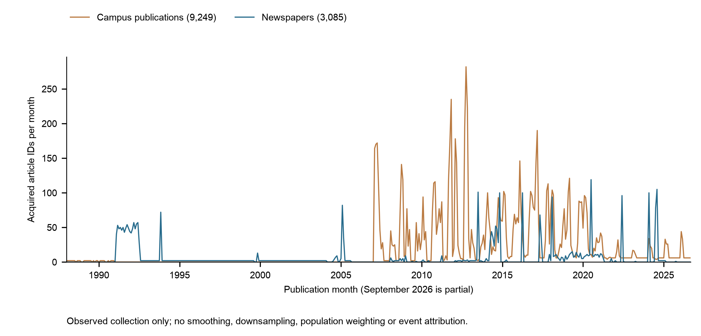

# Newspaper and public-expression collection review — 9 October 2026

## Accepted results and the current source frame

The two closed collector packages are accepted as bounded acquisition deliveries with their recorded structural checks and limitations. They are **not** accepted as complete newspaper history, general-public coverage, or a comparable emotion time series. The fixed publication interval remains **1988-01-01 through 2026-09-21**; September is partial. Later retrieval does not establish historical-body equivalence.

Dai's 9 October clarification prospectively excludes student newspapers from the newspaper analysis frame. The Tech, Trinity News, Beaver and Mancunion are now **campus publications**, retained on the social/public-expression side as a distinct publication subframe. Their editorial articles do not become native social posts or proven ordinary-public expressions. All stable article IDs, body versions, source dates and original store contents remain intact. This is a versioned analytical classification, not a rewrite of frozen collection outcomes or a physical merge of stores.

| View | Retained units | Pooled months at the two-known-work floor | One-work months | Zero-work months |
| --- | ---: | ---: | ---: | ---: |
| Frozen collector newspaper-labelled frame | 12,334 articles | 429 | 2 | 34 |
| Current newspaper frame, excluding four campus titles | **3,085 articles** | **262** | **18** | **185** |
| Campus-publication subframe | **9,249 articles** | Separately tabulated | Separately tabulated | Separately tabulated |
| Native social/API stream | **1,566 posts/questions/answers/comments/replies** | Newspaper floor does not apply | 85 months with any native body | 380 bins combine inapplicability, gaps and unknown scope |

The latest newspaper tranche contributed 2,601 IDs to its 9,733-ID predecessor. Current non-student sources are Green Left (1,205), InDaily (796), Devonport Flagstaff (335), Montpelier Bridge (308), Northern Rivers Times (196), Financial Mirror (165) and Otago Daily Times (80). Advocacy, business, local/community, digital-successor and regional-daily frames remain explicit. UK has no non-student newspaper article in this current register. This is an acquisition-frame limitation, not national publication absence.

The [article frame register](tables/article_frame_register.csv) retains every qualified ID exactly once. The [source composition](tables/source_composition.csv), [465-month calendars for both frames and all five strata](tables/monthly_frame_coverage.csv) and [203 current newspaper gaps](tables/current_newspaper_gaps.csv) define the revised counts. The frozen 36-month gap list remains separately traceable below. Known work-family identities do not resolve every syndication or mirrored-work relationship: the original register contains 12,318 known families across 12,334 IDs, and none is deleted for an exact-body overlap.

## Distribution and minimal intervention

The figure counts all 465 publication months with no smoothing, downsampling, reweighting or suppression. Its source data are the pooled rows of `monthly_frame_coverage.csv`; PNG is a 300-dpi review preview and SVG/PDF retain editable text. Counts describe acquired articles, not the publication population. No error bars or statistical tests are appropriate to these deterministic inventory totals. Visual inspection, source preflight, the 7-point minimum PDF text check and rendered collision check passed. One panel makes cross-panel alignment inapplicable; TIFF submission export is outside this internal report.

Dai directs **no article-count ceiling on newspaper writing**: neither two per month, a fixed monthly/source/stratum count nor a desired government/newspaper ratio should stop otherwise eligible production. This removes article-count quotas from the prospective policy. It does not remove actual disk/byte safeguards, source restrictions, fixed execution releases, API backoff, discovery or inherited PDF limits. Historic scopes/counters remain evidence; the expired collectors have not been restarted or silently patched under their old digest-bound releases.

All peaks remain. Nonperiodic bursts are plausible; a peak needs neither cyclic recurrence nor an adjacent-month trend to be retained. [Adjacent-month diagnostics](tables/adjacent_month_diagnostics.csv) record each month's count and preceding/following three-month context. A transparent **exploratory** screen flags counts of at least 20 that are at least three times the maximum observed adjacent count (using one as a zero-denominator guard). These defaults are diagnostic conveniences, not a statistical anomaly definition or an ingestion gate. The raw context columns permit a different screen without changing data. Missing end-of-calendar neighbors and partial September are explicitly marked; the comparison uses publication month, not Load time.

The [flag table](tables/flagged_months.csv) contains 17 series-month flags: seven pooled-newspaper, eight individual-newspaper and two campus-source flags. These overlap and must not be summed as distinct months. Every flag says `retain_and_flag`. [Largest newspaper months](tables/largest_newspaper_months.csv) retain source composition. InDaily's repeated roughly 100-record spikes coincide with its narrow acquired sitemap inventory; they are not independently evidenced breaking-news events. Green Left's November 1993 peak contains 70 records dated 17 November and two dated 3 November. Because another saved tranche has issue/article conflicts around the same 1993 date, this is a **named date-heaping question**, not proof that those 70 records are wrong. Resolve only their source/date evidence in a later bounded repair; retain them and the uncertainty meanwhile.

Prior scheduler selection at two per region-month, chronological prefixes, partially consumed inventories, access stops and the fixed deadline all shape this dataset. The successor production code no longer stops at two, but the historical imprint remains. Genre is unrecorded for 11,496 of the original 12,334 articles; `archive`, `just-in` and similar native categories are not validated journalistic genres. Do not infer genre from those labels or silently replace missing values. Source directness is relative to the recorded utterance; publisher provenance does not prove claim truth or the origin of quoted material.

## Exact historical gaps and actionable causes

The [36-row frozen gap/cause table](tables/frozen_36_gap_diagnosis.csv) gives each month, native/work count, required increment, exact evidence status and next action. All 36 remain deficient under the narrower newspaper frame; 167 additional months become deficient because campus titles no longer count. These are acquisition gaps, not assertions that newspapers did not exist.

| Named period | Saved evidence | Action and boundary |
| --- | --- | --- |
| 1988-08, 1988-12; 1989-01, 1989-08, 1989-10; 1990-01, 1990-06, 1990-07, 1990-09; 1991-01 | Narrow historical campus print recovery; all 36 issue-PDF slots consumed. No current accepted non-student newspaper article supplies these months. | Prepare suitable non-student historical parents. Further campus OCR cannot close the revised newspaper denominator. Preserve issue 108/54's identity conflict and the out-of-interval issue 107/56. No new PDF allowance is implied. |
| 1999-09 and 1999-10 | Nine issue URLs marked processed. Targeted inspection of saved issues 374 and 379 finds zero links in the actual issue-content directory; legacy whole-page parsing instead selects 20 current-2026 sidebar links in each. | Apply the prepared scoped parser and distinguish successful HTTP from successful historical discovery. Seek an alternative permitted native directory or archive route; do not assign sidebar stories the issue date. The other seven issue pages were not inspected. |
| 2004-03, 2004-04, 2004-05 | 145, 129 and 86 distinct saved article IDs respectively have issue-index/article-page date conflicts. May also has one unprocessed known issue. | Resolve the named mapping against dated publisher evidence. Preserve the whole-body evidence and original dates; do not fabricate dates to obtain coverage. |
| 2004-06 and 2004-07 | Four known unprocessed dated issues in each month; July has one qualified article. | Resume these native frontiers only under a new execution release. Unprocessed issue counts do not guarantee complete article yield. |
| 2004-11, 2004-12; 2005-09 through 2007-01 | No matching month in the retained Green Left issue frontier; 18 native index routes remain. December 2004 has one qualified article. | Advance the permitted chronology and broader eligible frames. Current frontier absence is not archive exhaustion. Month-specific publication and recovery remain unresolved. |

The two-page [parser evidence table](tables/named_issue_parser_evidence.csv) supports one concrete repair in `code/green_left_issue_candidates.py`: select the observed content-directory container, exclude sidebar content, verify issue identity, deduplicate links, preserve unresolved path/issue relations and emit an explicit empty-directory state. It makes no date inference and performs no HTTP or Load. Focused synthetic regressions and both saved named pages passed. Frozen collector code and raw pages were not altered; integration requires the next scoped collector implementation and its release digest.

The [frontier interpretation](tables/source_frontier_interpretation.csv) separates metadata discovery from remaining bodies. `exhausted` for Flagstaff and Northern Rivers means pagination ended, with **897** and **2,668** queued targets still unattempted. Financial Mirror has **6,819** queued unattempted targets and metadata pagination remaining. Montpelier Bridge has **437** queued targets, while US discovery is at **1,000/1,000**. These are opportunities, not promised qualified articles. InDaily has zero unattempted current queued targets; its generic retained-opportunities label does not establish a usable next route. ODT/Allied and the InDaily asset-host stops remain. The Portugal News body route remains blocked under its saved source-use finding.

## Social API and return-quality acceptance

The [social collection report](../social_public_api/summaries/COLLECTION_REPORT.md), registry, schema, response manifest, native identity/alias/context tables and actual API-return fields are accepted with their stated limits. All 23 final output/implementation hashes matched the final manifest; the earlier quality-export repair and first-50 preservation are reused, not re-audited. The eight quality rows total 1,566. Typed numeric ID collision, version preservation and body/date checks remain the collector's accepted changed-chain/changed-tranche evidence.

| Body source | Native units | Observed months | Return and interpretation limit |
| --- | ---: | ---: | --- |
| Sustainable Living Stack Exchange | 633 | 60 | Specialist Q&A; first 30 creation-ordered questions per year and bounded context |
| Earth Science Stack Exchange | 567 | 36 | Same prefix design; three native creation dates precede the recorded closed-beta day, with migration/history unresolved |
| Python Discussions | 128 | 6 | Ten topics from an initial chronological frontier; 50 truncated index previews were not counted as bodies |
| Mastodon IE / UK / AU / US instances | 40 / 40 / 40 / 35 | One each | Local public timelines near the cutoff; instance geography does not identify author country |
| Bluesky official account | 83 | 12 | Institutional account prefix, not ordinary-public role coverage |

The 83 Bluesky records are institutional; the other 1,483 author roles remain unknown. The source verified expression is retained without inventing author role, country, complete context or an open licence. Native unit totals are 823 questions, 177 answers, 200 comments, ten forum roots, 118 forum replies and 238 platform posts. Campus publication articles remain separate from all of these types and do not inflate the native social total.

The social wave ended after its **programmed bounded source frame completed**, not because its deadline or allocation was exhausted: 138/200 requests, 1,671/2,000 returned objects and about 14.1 MB of 128 MiB. The code explicitly stops after ten Python topics, annual first pages, a limited context cohort, four Mastodon snapshots and at most three official-account pages. Thus 62 requests and 329 returned-object slots were unused at closure. Their availability then is not authority to spend them after expiry. A public-API chain and source-quality result is accepted; broad public-expression acquisition remains unfinished.

Public reachability, collection/retention conditions, open licensing and redistribution are independent dimensions. An absent CC label alone is neither a private-source finding nor a blanket collection veto. Actual source prohibitions and missing approvals/credentials remain controlling. Saved findings include NZ Mastodon author-permission restrictions, Mumsnet copying/scraping limits, several 403/429 forum stops, missing verified forum interfaces, Reddit/Meta approval requirements and missing YouTube credentials. This review does not assert that current live conditions changed. No account applications or third-party contacts occurred.

Source-specific applicable eras must accompany the full 465-bin calendar. Pre-foundation bins are structurally inapplicable; earliest acquired text is not founding. Exact Mastodon instance/Bluesky actor starts remain unknown. Current bodies, including post-cutoff edits, are not certified historical versions. The source-calendar and context tables retain these distinctions.

## Ordered continuation preparation

1. **Integrate current frame and count policy.** Newspaper production excludes the four campus sources and has no article-count gate. Retain campus articles as their own frame. Keep every accepted ID/version and annotate peak/context issues without blocking writes. Implement the named Green Left parser repair in a new scoped adapter; retain the old parser and results as historical evidence.
2. **Consume broader observed newspaper inventories.** Flagstaff, Northern Rivers, Financial Mirror and the existing Bridge queue are immediate evidenced opportunities. Eligible daily/regional/general-interest titles should be developed alongside these frames, particularly the now-empty UK newspaper frame and early historical periods. Do not promise a population sample or choose sources to flatten counts. Bridge can consume saved targets without reopening the exhausted US discovery budget.
3. **Resolve targeted chronology in the same ELT line.** Work through unprocessed Green Left issues and remaining native index routes, resolving the 2004 mapping and the 1993 heaping question. Treat 1999's empty historical directory as an access/interface gap needing an evidenced route, not a solved parser-only coverage repair. No fresh PDF allowance or forbidden retry is implicit.
4. **Broaden genuine public-expression opportunities in the separate social line.** Continue documented Python topic/post-stream pagination, Q&A dated pages beyond annual prefixes and saved Mastodon cursors where source conditions allow. The Python retrieval-time 294,703-post inventory is not a pre-cutoff eligible count. Ordinary-user/community Bluesky collection needs a defined evidenced frame; more official-account pages do not solve public-role coverage. Respect anonymous page limits/backoff and source-era/context gaps.

A concrete local preparation plan proposes one fixed four-hour newspaper execution from an explicitly released start, with no article-count ceilings, the inherited discovery/parent/PDF limits and the shared **5,000,000,000-byte** cap. Social continuation is a separate bounded release decision, not a hidden append to the newspaper task. No new execution, bulk download, deadline, source permission or account access was released by this review. Review-time capacity was about 1.347 GB retained and 22.24 GB free; the original 15 GiB floor, 48 MiB recovery reserve, complete per-operation footprint and shared lock remain. Both collectors are idle, lifetime mutexes available, the recorded newspaper PID absent and stale logical leases factually closed. Historical counters/stops remain intact.

## Verification and publication

The metadata-only review reconciled 20 selected newspaper final files and 23 social final outputs/implementation files against saved hashes. It did not reopen either database, copy a store, rescan old bodies, repeat accepted tests or inspect sealed evaluator material. Only the two named saved issue-directory responses were read to resolve the newly identified parser inconsistency. The derived frame register partitions 12,334 IDs into 3,085 newspaper and 9,249 campus IDs with no loss; all six geographic ledgers have 465 rows per frame. No fear/topic/affect labels or semantic exclusions were executed.

Main deliverables are acquisition source code, source/schema documentation, final consolidated metadata/link/hash tables, the current frame review and descriptive figure. Frozen final collector reports retain their original definitions; this review supplies the current interpretation. Stores, raw/full bodies, queues, release/lease controls, intermediate checkpoints and per-target receipts stay local. Original implementations depend on historical local controls; they are published for traceability, not as authorization to execute an expired collector or a promise of turnkey operation on a new checkout. `build_review.py` is independently reproducible from the local finalized metadata, without collector imports; `--reuse-reconciliation` reuses the saved metadata hash reconciliation when only derived reporting changes.

| Evidence level | Current result |
| --- | --- |
| Dated source presence and readable text | Accepted within saved source/native-unit checks and explicit gaps/conflicts |
| Climate/warming relevance and similarity | Deferred to defined, validated analysis units and source frames |
| Affect/risk/future-harm/responsibility association | Deferred; not automatically fear |
| Fear-specific interpretation | Deferred; requires traceable passages and validated holder/target/horizon/quotation/negation interpretation |
